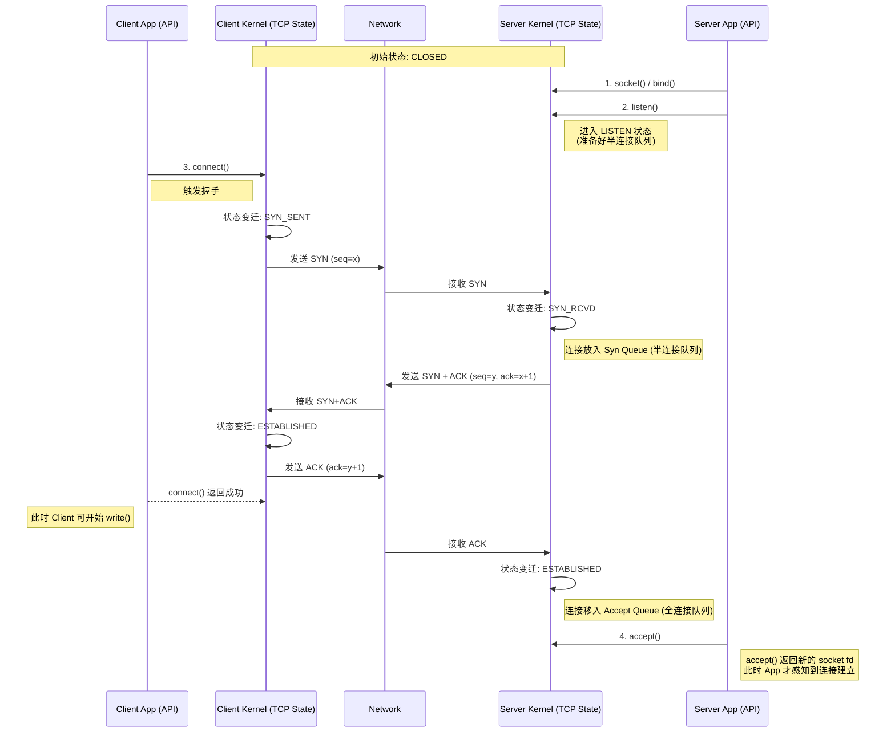
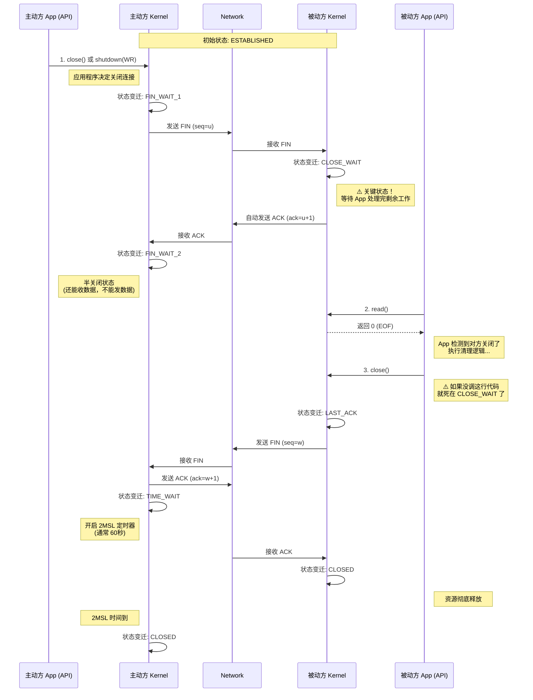

<div id="chap-socket"></div>

[⬆️ 返回目录](#catalog)


## 套接字

这是一个非常经典的**网络编程底层原理**问题。很多初学者都会困惑：“如果端口被监听套接字占用了，新生成的套接字怎么还能用同一个端口？它们怎么区分数据？”

答案的核心在于：**在内核眼里，标识一个连接的不仅仅是端口，而是一个“五元组”；而套接字（Socket）本质上是内核中的一个数据结构，它自带了“接收缓冲区”和“发送缓冲区”。**

我们从**身份识别（五元组）**、**数据读取（接收）**、**数据写入（发送）**三个维度来深度解剖。

---

### 一、 核心密钥：TCP 连接的“五元组”

你疑惑的点在于，你觉得端口是唯一的区分标准。其实不然。

在 TCP/IP 协议栈中，操作系统内核（Kernel）区分每一个独立的 TCP 连接，依据的是 **五元组 (5-Tuple)**：

$$ \{源IP, 源端口, 目的IP, 目的端口, 协议(TCP)\} $$

#### 1. 监听套接字 (Listening Socket)
当你调用 `bind(80)` 和 `listen()` 时，内核创建了一个处于 `LISTEN` 状态的套接字。它在内核表中的记录大概是这样的（通配符）：
*   **标识**：`{ *, *, 本机IP, 80, TCP }`
*   **职责**：只负责“接客”（处理 SYN 握手），不负责“聊天”（传输数据）。

#### 2. 已连接套接字 (Connected Socket)
当客户端（假设 IP: 1.2.3.4, 端口: 10001）连接上来，服务端调用 `accept()` 返回一个新的套接字。这个新套接字在内核中的记录是**全具体**的：
*   **标识**：`{ 1.2.3.4, 10001, 本机IP, 80, TCP }`
*   **职责**：专门负责和这个特定的客户端传输数据。

**关键点：** 虽然“目的端口”都是 80，但因为“源IP”和“源端口”不同，内核完全可以将它们区分开。哪怕有 10000 个客户端连接，只要它们的 `{源IP, 源端口}` 组合不同，内核就能生成 10000 个不同的已连接套接字，且互不干扰。

---

### 二、 它是如何知道“哪里的数据需要去读”？ (多路分解 / Demultiplexing)

当网卡收到一个数据包时，操作系统内核需要决定把这个包丢给谁。这个过程叫 **多路分解**。

1.  **数据包到达**：
    网卡收到一个 TCP 报文，解析 IP 头和 TCP 头，提取出发送方的 IP (`1.2.3.4`) 和端口 (`10001`)，以及接收方的 IP (`本机`) 和端口 (`80`)。

2.  **查表 (Hash Lookup)**：
    内核维护着一张庞大的 **哈希表 (Hash Table)**，里面记录了所有当前活动的 Socket（包括监听的和已连接的）。
    内核拿着数据包里的**五元组**去表里匹配。

3.  **精准匹配 (Exact Match)**：
    内核发现有一个已连接套接字完全匹配 `{ 1.2.3.4, 10001, 本机IP, 80, TCP }`。
    **于是，内核直接把数据包里的 Payload（有效载荷）复制到这个特定套接字的【接收缓冲区】中。**

4.  **应用层读取**：
    你在代码中持有的那个 `new_socket_fd`（文件描述符），本质上就是指向内核中这个特定套接字结构的索引。
    当你调用 `read(new_socket_fd, ...)` 时，操作系统就去这个套接字的**接收缓冲区**里把数据捞出来给你。

    *如果数据包是 SYN 包（握手请求），内核查表发现没有精准匹配的连接，但匹配到了监听套接字 `{ *, *, *, 80 }`，于是内核就会走握手流程，而不是数据传输流程。*

---

### 三、 它是如何知道“写的数据放哪里”？ (PCB 上下文)

当你在服务端调用 `write(new_socket_fd, "Hello")` 时，你并没有指定要发给谁（没有传目标 IP 和端口），系统怎么知道发给谁？

这就涉及到了套接字的内部结构 —— **TCP 控制块 (TCB / PCB - Protocol Control Block)**。

1.  **上下文记忆**：
    当 `accept()` 成功创建这个 `new_socket_fd` 时，内核已经在对应的 TCB 结构体中**写死了**对端的信息：
    *   `sk_daddr` (Destination Address) = 1.2.3.4
    *   `sk_dport` (Destination Port) = 10001

2.  **数据封装**：
    当你写入数据时，内核首先把数据放入该套接字的 **【发送缓冲区】**。
    然后，TCP 协议栈从发送缓冲区取数据，准备封装成 TCP 报文。
    **重点来了**：内核会自动从 TCB 中读取之前存好的 `sk_daddr` 和 `sk_dport`，将它们填入 TCP/IP 协议头的“目的地址”和“目的端口”字段中。

3.  **路由与发送**：
    封装好的数据包交给 IP 层，IP 层查路由表，通过网卡发出去。因为头上顶着 `1.2.3.4:10001`，数据自然就能准确到达那个客户端。

---

### 四、 总结图解

为了形象理解，你可以把**端口 80**想象成一栋大楼的**总前台**。

1.  **监听套接字 (Listening Socket)**：
    是**前台接待员**。她站在大门口（Port 80），手里拿个大喇叭。只要有新客人（SYN）来，她就负责登记。
2.  **新生成的套接字 (Connected Socket)**：
    一旦客人登记完，接待员会分配一个**专属会议室**（新的 Socket FD）给这个客人，并指派一个**专属服务员**（内核 TCB）。
    *   **读数据**：当邮递员送信来时，看到信封上写着“寄给：张三（源IP:Port）”，邮递员查表知道张三在 101 会议室，于是直接把信塞进 101 的信箱（接收缓冲区）。
    *   **写数据**：你在 101 会议室写回信时，不需要在信封上写地址。你只要把信给专属服务员，服务员手里的小本本早就记下来“101 的张三住在哪里”，他会自动帮你填好地址寄出去。

### 技术总结

*   **读数据（入）**：靠**内核哈希表**进行**五元组匹配**，定位到唯一的 Socket 结构体，存入其**接收缓冲区**。
*   **写数据（出）**：靠 Socket 结构体（TCB）中**存储的对端上下文信息**（IP/Port），自动封装目标地址，从**发送缓冲区**发出。
*   **端口占用**：监听套接字占用的是“通配符匹配权”，已连接套接字占用的是“特定五元组匹配权”，二者不冲突。


这是一个非常硬核的协议细节问题，直击 TCP 可靠传输的核心机制。

简单直接的回答是：
1.  **数据包大小不是固定的**，它是动态变化的，受限于链路层的物理限制和当前的拥抱控制状态。
2.  防重和防乱序完全依赖于 TCP 头部中的 **序列号 (Sequence Number)**，配合内核接收缓冲区的 **滑动窗口 (Sliding Window)** 和 **乱序队列 (Out-of-Order Queue)** 来实现。

下面我们深入内核原理，分两部分详细剖析。

---

### 第一部分：TCP 数据包大小是固定的吗？

**不是固定的。**

TCP 是面向字节流（Stream-oriented）的协议，它根本不知道什么是“包”，它只知道应用层给它扔了一堆字节。TCP 会根据情况把这些字节切分成段（Segment）。

一个 TCP 数据包（Segment）的大小受以下几个因素的共同制约：

#### 1. 核心限制：MSS (Maximum Segment Size)
这是 TCP 数据包大小的“天花板”。
*   在三次握手期间，通信双方会协商 MSS。
*   **计算公式**：`MSS = MTU - IP头长度(20字节) - TCP头长度(20字节)`。
*   **常见值**：以太网的 MTU 通常是 1500 字节，所以 **MSS 通常是 1460 字节**。这意味着一个 TCP 包的数据部分最大通常不超过 1460 字节。

#### 2. 动态因素：为什么会有小包？
虽然有 MSS 限制最大值，但实际传输中经常会出现比 MSS 小得多的包：
*   **应用层行为**：比如 SSH 协议，你敲一个键盘，应用层就让 TCP 发一个字节。这时候 TCP 包可能只有几十个字节（数据极少，全是头）。
*   **Nagle 算法**：为了防止网络中充斥着极小的包，Nagle 算法会尝试把应用层多次写入的小数据“攒”成一个大包再发。但如果应用层设置了 `TCP_NODELAY`（比如网络游戏），则会强制发送小包。
*   **接收窗口 (rwnd)**：如果接收方的缓冲区快满了，通告了一个很小的窗口（比如剩余空间只有 500 字节），发送方被迫只能发 500 字节的包，哪怕 MSS 是 1460。

**结论**：TCP 包的大小是 **0 (纯ACK) ~ MSS** 之间的任意值。

---

### 第二部分：接收缓冲区是如何防重和防乱序的？

这是 TCP 协议栈最复杂的处理逻辑之一。内核中的 TCP 接收部分，实际上维护了两个关键的数据结构（概念模型）：
1.  **接收队列 (Receive Queue)**：存放已经按顺序排好的、准备被应用层读取的数据。
2.  **乱序队列 (Out-of-Order Queue)**：存放已经收到、但是前面还有“坑”（缺口）的数据。

核心依靠的是 **Sequence Number (SEQ)**。

假设：
*   接收方当前的 **期望序列号 (`RCV.NXT`)** 是 **100**。
*   意味着：字节 0~99 都收到了，现在坐等字节 100。

#### 1. 如何防重 (De-duplication)？

防重的逻辑非常简单：**比对 SEQ 与 RCV.NXT**。

当一个数据包到达时，内核会检查它的 `SEQ` 范围：

*   **场景**：收到了一个包，SEQ = 50，长度 = 20（即数据范围 50~69）。
*   **判断**：内核一看，当前 `RCV.NXT` 已经是 100 了。
*   **逻辑**：`SEQ(50) + LEN(20) < RCV.NXT(100)`。说明这个包里的数据，我之前早就收到了！
*   **处理**：**直接丢弃 (Drop)**。
*   **回应**：虽然丢弃了数据，但通常会回一个 ACK（确认号还是 100），告诉发送方：“别发旧的了，我想要的是 100”。

*特殊情况*：如果收到的包是 SEQ=90，长度=20（范围 90~109）。这叫“部分重叠”。内核会裁剪掉 90~99 这部分旧数据，只保留 100~109 这部分新数据。

#### 2. 如何防止乱序 (Reordering)？

TCP 保证给应用层的数据必须是顺序的。如果网络层送来的包是乱的，TCP 内核必须自己把它们拼好。

**场景模拟：**
*   **状态**：`RCV.NXT` = 100。
*   **事件**：发送方发了包 A (100~199) 和 包 B (200~299)。
*   **问题**：因为网络拥堵，**包 B 先到了**，包 A 还没到。

**内核处理流程：**

1.  **收到包 B (200~299)**：
    *   内核检查 SEQ=200。
    *   发现 `SEQ(200) > RCV.NXT(100)`。
    *   **判断**：这不是我马上要的，中间缺了 100~199（产生了 **Gap/空洞**）。
    *   **动作**：内核**不能**把包 B 放入“接收队列”给应用层读（否则就乱序了）。
    *   **存储**：内核将包 B 放入 **乱序队列 (OFO Queue)**。在 Linux 内核中，这通常是一个**红黑树 (RB-Tree)** 结构，按序列号排序，以便快速插入和查找。
    *   **回应**：发送 **重复 ACK (Duplicate ACK)**，确认号依然是 100。意思是：“我收到了一个包，但我还在等 100”。（如果开启了 SACK，还会告诉发送方“我收到了 200~299”）。

2.  **收到包 A (100~199)**：
    *   包 A 终于姗姗来迟。
    *   内核检查 SEQ=100。
    *   发现 `SEQ(100) == RCV.NXT(100)`。**Bingo！**
    *   **动作 1**：将包 A 放入 **接收队列**。
    *   **动作 2**：更新 `RCV.NXT` = 200。
    *   **动作 3 (关键)**：内核立马去检查 **乱序队列**。
        *   发现里面存着一个包 B (200~299)。
        *   刚好能接上现在的 `RCV.NXT` (200)。
        *   于是，把包 B 从乱序队列里拿出来，挪到接收队列，拼在包 A 后面。
    *   **动作 4**：更新 `RCV.NXT` = 300。

3.  **结果**：
    虽然网络是乱的（先 B 后 A），但 TCP 内核通过暂存（Buffering）和重组（Reassembly），使得应用层 `read()` 读到的数据依然是完美的顺序流（先 A 后 B）。

### 总结

*   **大小**：不固定，由 MSS 封顶，受应用层写入和窗口控制动态调整。
*   **防重**：靠比较 `SEQ` 和 `RCV.NXT`，**小于期望值的直接丢弃**。
*   **防乱**：靠 **乱序队列 (OFO Queue)**。超前的包先**暂存**不给应用层，等缺口填补上之后，再**批量合并**提交。

这是一个非常经典且触及操作系统设计哲学的核心问题。

**一句话总结：**
在 Linux/Unix 哲学中，**Socket 被视为“文件”**。`read` 返回 `0` 代表 **EOF (End Of File)**，即“文件读完了/结束了”。而“没有数据（暂时没数据）”的表现形式取决于你是用 **阻塞 (Blocking)** 还是 **非阻塞 (Non-Blocking)** 模式。

下面为你详细拆解设计的底层逻辑：

---

### 一、 为什么返回 0 代表“对方关闭” (EOF)？

#### 1. "Everything is a File" (一切皆文件)
Unix/Linux 的设计哲学是：无论是读硬盘上的文本文件，还是读网络上的 Socket 连接，或者读取键盘输入，操作系统都提供统一的接口：`open`, `read`, `write`, `close`。

*   **读文件时**：当你读到文件的末尾，没有更多字节可读了，`read` 会返回 `0`。这时你知道文件结束了。
*   **读 Socket 时**：操作系统把 TCP 连接抽象成一个流（Stream）。当对方发送了 **FIN 包**（表示“我说完了”），对于接收方内核来说，就等同于这个“流”到了末尾。此时调用 `read`，内核就返回 `0`，告诉你“像读文件读到头一样，这个连接也读到头了”。

#### 2. 状态的唯一性
`0` 是一个特殊的、确定的返回值，用来表示一个**永久性的状态变化**。
*   如果 `read` 返回 `0`，意味着**以后永远也不会有数据来了**（除非你重新建立连接）。这是一个终止信号。

---

### 二、 那么，“没有数据”是怎么表示的？

这完全取决于你的 Socket 是 **阻塞 (Blocking)** 的还是 **非阻塞 (Non-Blocking)** 的。

#### 情况 A：阻塞模式 (Blocking I/O) —— 默认模式
这是最常见的情况。

*   **现象**：
    当你调用 `read(fd, buf, len)` 时，如果接收缓冲区里**是空的（没有数据）**，`read` 函数**根本不会返回**。
*   **发生了什么**：
    当前线程会被操作系统**挂起 (Sleep/Block)**，进入睡眠状态。
*   **什么时候返回？**
    1.  **有数据来了**：网卡收到数据，内核唤醒线程，`read` 返回读到的字节数 (`> 0`)。
    2.  **对方断开了**：网卡收到 FIN 包，内核唤醒线程，`read` 返回 `0`。
    3.  **出错了**：比如被信号打断，`read` 返回 `-1`。

**结论**：在阻塞模式下，**“没有数据”的表现就是“卡住不动”**，而不是返回某个特定值。

#### 情况 B：非阻塞模式 (Non-Blocking I/O)
如果你通过 `fcntl` 把 Socket 设置成了 `O_NONBLOCK`，`read` 的行为就会改变。

*   **现象**：
    当你调用 `read(fd, buf, len)` 时，如果接收缓冲区是空的，`read` **立即返回**。
*   **返回值**：
    它返回 **`-1`** (Error)。
*   **怎么区分是“出错了”还是“没数据”？**
    你需要检查全局变量 **`errno`** (在 C 语言中)。
    *   如果 `read` 返回 `-1` 且 `errno == EAGAIN` (或 `EWOULDBLOCK`)：
        **这代表“现在没数据，但这并不是错误，请过一会再来试”**。
    *   如果 `read` 返回 `-1` 且 `errno` 是其他值（如 `ECONNRESET`）：
        这才是真正的网络错误。

---

### 三、 总结对比表 (程序员必背)

| 场景 | 阻塞模式 (Blocking) | 非阻塞模式 (Non-Blocking) |
| :--- | :--- | :--- |
| **有数据** | 返回 `n > 0` (字节数) | 返回 `n > 0` (字节数) |
| **没数据 (暂时空)** | **挂起线程，等待** (函数不返回) | **立即返回 `-1`**，且 `errno` 为 `EAGAIN` |
| **对方关闭 (收到 FIN)** | 返回 `0` (EOF) | 返回 `0` (EOF) |
| **真正出错** | 返回 `-1` (查看 errno) | 返回 `-1` (查看 errno) |

---

### 四、 代码视角的直观感受

用伪代码来看这三种状态的区别：

```c
int n = read(socket_fd, buffer, 1024);

if (n > 0) {
    // 1. 读到了数据
    process_data(buffer, n);
} 
else if (n == 0) {
    // 2. 对方关闭了连接 (EOF)
    // 只有收到 FIN 包时，内核才会让 read 返回 0
    close(socket_fd);
    printf("Peer closed connection\n");
} 
else {
    // 3. n 为 -1，出错了
    if (errno == EAGAIN || errno == EWOULDBLOCK) {
        // [仅在非阻塞模式下会出现]
        // 意思是：缓冲区是空的，连接是健康的。
        // 你可以去干点别的事，或者等会再来轮询。
        printf("No data right now, try later...\n");
    } else {
        // 真正的致命错误 (如连接重置 RST)
        perror("Read error");
        close(socket_fd);
    }
}
```

### 五、 补充：水管的比喻

*   **Socket** = 水管。
*   **Data** = 水。
*   **Read** =拿桶接水。

1.  **返回 > 0**：接到了水。
2.  **返回 0 (EOF)**：水厂把你家总闸**关了**，并且贴了封条。告诉你“以后这根管子永远不会有水了”。
3.  **阻塞等待**：水管里没水，但是总闸没关。你就**一直傻站在那等**，直到有水流出来。
4.  **返回 -1 (EAGAIN)**：水管里没水，总闸没关。你拿个桶去接，发现没水，你就**先去玩手机**，过一会再来看看。

所以，`read` 返回 `0` 代表的是一种**“终结状态”**，而不仅仅是“空状态”。

这是一个非常专业的需求。作为资深程序员，我们不仅要画出数据包的流向（SYN/ACK），更要精准地将 **Socket API（应用层）** 与 **内核 TCP 状态机（传输层）** 的交互映射出来。

很多初级教程忽略了 API 的调用时机，导致开发者在遇到 `CLOSE_WAIT` 等问题时不知道是哪行代码出了问题。

以下使用 Mermaid 流程图进行描述，**左侧代表客户端（Client），右侧代表服务端（Server）**。

---

### 一、 TCP 三次握手 (Connect) —— API 与状态映射

**核心视角**：
*   **Client**: `connect()` 是阻塞的（默认），直到握手完成或超时才返回。
*   **Server**: `listen()` 只是开启监听模式。`accept()` 是从全连接队列里“取”连接，它发生在握手完成**之后**。



**资深程序员注记：**
1.  **`listen()`**: 此调用导致 Server 进入 `LISTEN` 状态。
2.  **`connect()`**: 此调用导致 Client 发送 SYN 并进入 `SYN_SENT`。只有当收到 Server 的 SYN+ACK 并回包后，`connect()` 才会返回 0（成功）。
3.  **`accept()`**: 请注意，三次握手完全由**内核**自动完成，`accept()` 不参与握手过程，它只是在握手完成后，从队列里拿结果。

---

### 二、 TCP 四次挥手 (Close) —— API 与状态映射

**核心视角**：
*   这里假设 **Client 是主动关闭方**，**Server 是被动关闭方**。
*   **关键点**：被动方收到 FIN 后，内核会自动回 ACK，但**不会自动发送 FIN**。发送 FIN 必须由被动方的应用层代码显式调用 `close()` 触发。这就是 `CLOSE_WAIT` 的根源。



**资深程序员注记：**

1.  **`close()` (主动方)**: 导致发送 FIN 包，状态由 `ESTABLISHED` -> `FIN_WAIT_1`。
2.  **`read()` 返回 0**: 这是被动方内核告诉应用层“对方已经发 FIN 了，进入 `CLOSE_WAIT` 了”。
3.  **`close()` (被动方)**: **至关重要！** 只有应用层调用了 `close()`，被动方才会发 FIN 包，状态才会从 `CLOSE_WAIT` -> `LAST_ACK`。如果代码里漏了这一步，服务器就会堆积大量 `CLOSE_WAIT` 连接。
4.  **`TIME_WAIT`**: 主动方收到对方的 FIN 并回 ACK 后，**自动**进入此状态，不由 API 控制。

<!-- 跳转链接 -->
[⬆️ 返回目录](#catalog)  |  [文章开头 ➡️](#chap-socket)