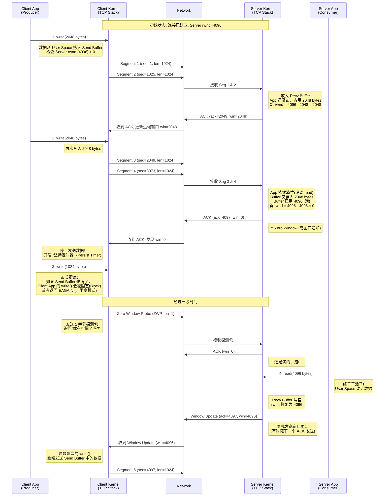

<div id="chap-window"></div>

[⬆️ 返回目录](#catalog)


## 发送窗口

这是一个非常硬核且核心的 TCP 问题。要彻底理解 TCP 的传输机制，必须把**发送窗口**、**接收窗口**、**拥塞窗口**以及**重传机制**揉在一起看。它们共同构成了 TCP 的**流量控制 (Flow Control)** 和 **拥塞控制 (Congestion Control)** 体系。

我们从底层的数据结构和算法视角来拆解。

---

### 一、 宏观视角：窗口到底是什么？

在内核中，窗口（Window）本质上是**缓存区（Buffer）的一个逻辑切片**。

还记得我们刚才说的“发送缓冲区”和“接收缓冲区”吗？
*   **接收窗口 (rwnd)**：是**接收端**根据自己缓冲区还剩多少空地，告诉发送端的“建议值”。
*   **发送窗口 (swnd)**：是**发送端**计算出来的一个范围，表示“我现在无需等待 ACK 确认，可以直接发送的数据量”。

#### 核心公式
程序员必须记住这个公式，发送窗口的大小决不是随意定的，而是受限于两个因素：

$$ \text{发送窗口} = \min(\text{接收窗口 rwnd}, \text{拥塞窗口 cwnd}) $$

*   **rwnd (Receiver Window)**：**对方**的能力（怕把对方发撑了）。
*   **cwnd (Congestion Window)**：**网络**的能力（怕把网络发堵了）。

---

### 二、 接收窗口 (rwnd) 与 滑动机制

这是流量控制的核心。

1.  **通告 (Advertise)**：
    接收端在回复 ACK 时，会在 TCP 头部的 `Window Size` 字段里填入当前接收缓冲区剩余的大小。比如：“ACK=100, Win=4000”。意思是：“我期待你发序列号 100，我家里还有 4000 字节的空位。”

2.  **滑动逻辑**：
    假设发送方发送了 2000 字节。
    *   **发送前**：发送方知道 rwnd=4000，可用窗口=4000。
    *   **发送后**：发送方发了 2000 字节，这 2000 字节在**未被确认**之前，依然占据窗口份额。可用窗口变成了 2000。
    *   **收到确认**：接收方处理完了这 2000 字节，应用层读走了，缓冲区空出来了。接收方回复 ACK，再次通告 `Win=4000`。
    *   **窗口滑动**：发送方收到 ACK，将窗口的**左边缘**向右移动，释放了旧空间，窗口又变回 4000 可用。

3.  **零窗口 (Zero Window)**：
    如果接收方应用层处理太慢，缓冲区满了，它会通告 `Win=0`。
    发送方收到后，必须**停止发送**。
    *   **死锁问题**：如果接收方后来有了空间，发了一个 `Win=4000` 的更新包，但这个包丢了，怎么办？发送方死等，接收方也在等。
    *   **解决方案**：发送方会启动一个 **坚持定时器 (Persist Timer)**，定期发送只有一个字节的 **“窗口探测包” (Zero Window Probe)**，问接收方：“哥们，有空位了吗？”

---

### 三、 发送窗口 (swnd) 的内部结构

在内核的发送缓冲区中，数据被分为 4 个部分：

```text
|   #1 已发送已确认   |   #2 已发送未确认   |   #3 允许发送但未发送   |   #4 不允许发送   |
                      ^                   ^                     ^
                   窗口左沿              P指针                 窗口右沿
```

1.  **#1 (Sent & Acked)**：数据已被对方收到确认，可以从缓冲区删除了（释放内存）。
2.  **#2 (Sent & Not Acked)**：**这是重传机制的根据地**。数据发出去了，但还没收到 ACK。这部分数据**必须保留在缓冲区里**，万一丢包了还得重发。这部分占据了发送窗口的额度。
3.  **#3 (Not Sent, Inside Window)**：这就是**可用窗口 (Usable Window)**。发送方可以随时把这部分数据扔到网络上。
4.  **#4 (Outside Window)**：超过了 rwnd 或 cwnd 的限制，暂时不能发。

**滑动窗口的本质**：当收到 ACK 时，**窗口左沿**向右移动；当发送数据时，**P 指针**向右移动。

---

### 四、 重传原理 (Retransmission)

重传是 TCP 可靠性的基石。TCP 既然承诺“不丢包”，就必须有办法把丢了的包补回来。主要有两种机制：**超时重传** 和 **快速重传**。

#### 1. 超时重传 (RTO - Retransmission Timeout)

这是最底层的兜底机制。**每发送一个报文段，TCP 就会为它启动一个定时器。**

*   **原理**：如果在定时器到期（RTO 时间）之前没收到 ACK，我就认为包丢了，重发。
*   **技术难点：RTO 设为多少？**
    *   设短了：包还在路上没到，你就重发，浪费带宽。
    *   设长了：包早丢了，你还在傻等，延迟极高。
*   **解决方案：自适应算法 (Jacobson / Karn 算法)**
    内核会实时测量 **RTT (Round Trip Time，往返时间)**。
    *   `SRTT` (平滑 RTT)：对多次测量的 RTT 求加权平均。
    *   `RTTVAR` (RTT 波动值)：计算网络抖动。
    *   **公式**：`RTO = SRTT + 4 * RTTVAR`。
    *   **指数退避**：如果超时重传了还是失败，下一次的 RTO 会**翻倍**（1s -> 2s -> 4s），防止拥塞崩溃。

#### 2. 快速重传 (Fast Retransmit)

超时重传太慢了（通常 RTO 至少几百毫秒甚至秒级）。快速重传是一种更聪明的机制。

*   **触发条件：收到 3 个重复的 ACK (3 Duplicate ACKs)**。
*   **场景推演**：
    发送方发了包：1, 2, 3, 4, 5。
    1.  包 1 到达 -> 回 `ACK 2`（期待包2）。
    2.  **包 2 丢了**。
    3.  包 3 到达 -> 接收方发现乱序（存入乱序队列），但必须回 ACK。回什么？**必须回 ACK 2**（因为 TCP 确认的是“连续收到的最大序号”）。
    4.  包 4 到达 -> 回 `ACK 2`。
    5.  包 5 到达 -> 回 `ACK 2`。
*   **发送方视角**：
    我收到了一个正常的 ACK 2，紧接着又收到了 **3 个重复的 ACK 2**。
    **推断**：包 2 肯定丢了，别等定时器了，**立即重传包 2**！

#### 3. SACK (Selective Acknowledgment) —— 现代标配

上面的快速重传有个问题：**我重传了包 2，那包 3, 4, 5 要不要重传？**
如果不重传，万一 3 也丢了呢？如果全重传，3, 4, 5 明明到了，浪费带宽。

**SACK 选项**解决了这个问题。
在 TCP 头部里，接收方可以告诉发送方：“ACK 2，但我收到了 `[300-500]` 和 `[700-900]` 这两段数据”。
这样，发送方一看就知道：哦，只要重传包 2 和 包 4（500-700段），其他的不用管。

### 总结

1.  **发送窗口**：`min(rwnd, cwnd)`。决定了能并发发多少数据。
2.  **接收窗口**：流量控制手段，防止把接收方撑死。
3.  **发送缓冲区**：存放“已发未确认”的数据，直到收到 ACK 才删除。
4.  **超时重传**：基于 RTT 动态计算 RTO，是兜底手段，慢但稳。
5.  **快速重传**：基于 3 个重复 ACK，无需等待超时，快。
6.  **SACK**：精准补发，效率最高。

作为一个资深程序员，理解 TCP 流量控制（Flow Control）不能只看“滑窗”，必须深入到 **User Space（用户态）与 Kernel Space（内核态）的数据拷贝**、**Socket Buffer（缓冲区）的填充与消耗**，以及 **Window Scale（窗口扩大因子）** 的实际影响。

流量控制的本质是：**平衡“发送方生产数据的速度”与“接收方应用层消费数据的速度”，防止接收方内核缓冲区（Recv Buffer）溢出。**

这是与**拥塞控制（Congestion Control）**完全不同的概念：
*   **流量控制**：解决的是**接收端**处理不过来的问题（点对点）。
*   **拥塞控制**：解决的是**网络链路**堵塞的问题（全局）。

以下是基于 **滑动窗口 (Sliding Window)** 机制的深度交互流程图。

---

### TCP 流量控制深度交互图 (Sliding Window & Zero Window)

**场景设定**：
1.  **MSS** (Max Segment Size) = 1024 bytes。
2.  **Server (Receiver)** 初始接收窗口 `rwnd` = 4096 (4KB)。
3.  **Server 应用层** 突然繁忙，暂停调用 `read()`，导致缓冲区积压。



---

### 二、 资深程序员必须关注的 4 个技术细节

你在看这张图的时候，脑子里必须映射出以下内核参数和代码行为：

#### 1. `rwnd` 的计算公式 (The Math)
在内核 `tcp_input.c` 逻辑中，通告窗口大小大致等于：
```c
// 伪代码
rwnd = RecvBufferTotal (SO_RCVBUF) - RecvBufferUsed;
```
*   **RecvBufferTotal**: 由 `sysctl -w net.ipv4.tcp_rmem` 或 `setsockopt(SO_RCVBUF)` 设置。
*   **RecvBufferUsed**: 已经收到并确认，但**应用层还没 `read()` 走**的数据。

#### 2. 发送端的“双重阻塞”
当收到 `win=0` 时：
1.  **TCP 层阻塞**：内核协议栈停止构建新的 TCP Segment 发往网卡。
2.  **应用层阻塞**：Client App 继续狂调 `write()`，数据会堆积在 Client 的 **Send Buffer**。一旦 Send Buffer 满了（由 `SO_SNDBUF` 决定），`write()` 调用就会**阻塞**（Blocking I/O）或者报错 `EAGAIN/EWOULDBLOCK`（Non-blocking I/O）。
    *   *Debug 技巧*：如果你发现客户端进程 hang 住了，看下 `netstat/ss` 的 **Send-Q** 是否很高，且连接状态正常。

#### 3. 糊涂窗口综合症 (Silly Window Syndrome)
如果 Server App 每次只 `read()` 1 个字节，`rwnd` 就会变成 1。Client 如果傻傻地发 1 个字节的数据包（Header 40字节 + Data 1字节），效率极低。
*   **接收端解决 (Clark算法)**：如果空闲空间太小（比如 < MSS/2），直接通告 `win=0`，骗发送端说没空间了，等腾出大块空间再说。
*   **发送端解决 (Nagle算法)**：积攒数据，直到凑够一个 MSS 或者收到上一个包的 ACK 才发。

#### 4. Window Scale (长肥管道问题)
早期的 TCP 头里 Window Size 只有 16位（最大 65535 字节）。在现在的千兆/万兆网络下，64KB 太小了，还没跑满带宽窗口就耗尽了。
*   **解决方案**：TCP 握手时协商 `Window Scale` 选项（比如移位 7，即乘 128）。
*   **资深视角**：抓包看 Window Size 时，一定要看握手包里的 Scale Factor，否则你看到的 `win=500` 实际上可能是 `500 * 128 = 64000`。

### 三、 总结
TCP 流量控制不仅仅是网络层面的“暂贴”，它直接**耦合**了：
1.  接收端的 **`read()` 频率**。
2.  发送端的 **`write()` 行为**。
3.  操作系统的 **Buffer 内存管理**。

理解了这个图，你就理解了为什么数据库（如 MySQL）查询慢时，Web 服务器（如 Tomcat/Node.js）的连接数会暴涨且内存不释放——因为数据都堵在 TCP Buffer 里了。
<!-- 跳转链接 -->
[⬆️ 返回目录](#catalog)  |  [文章开头 ➡️](#chap-window)