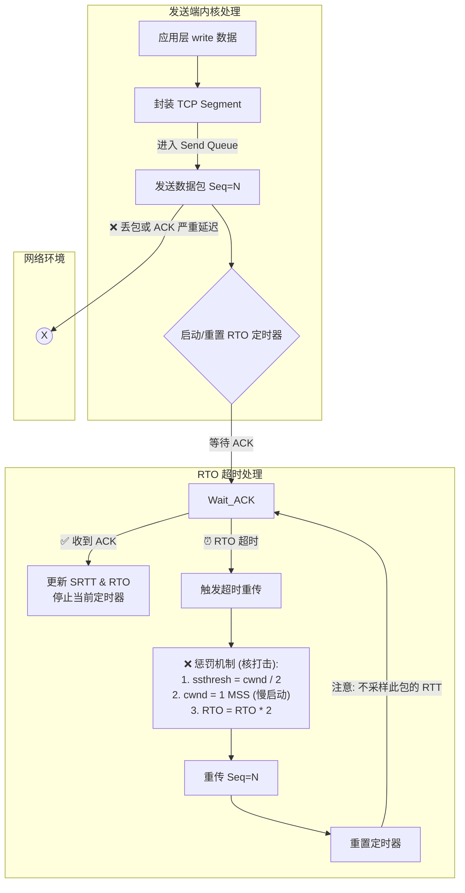
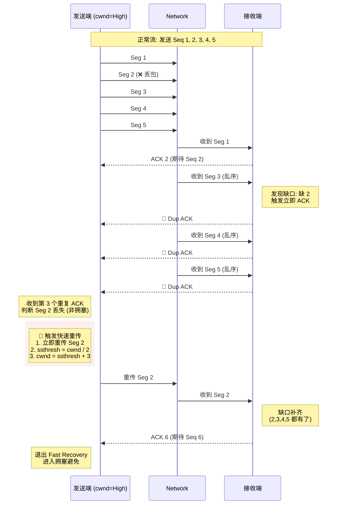
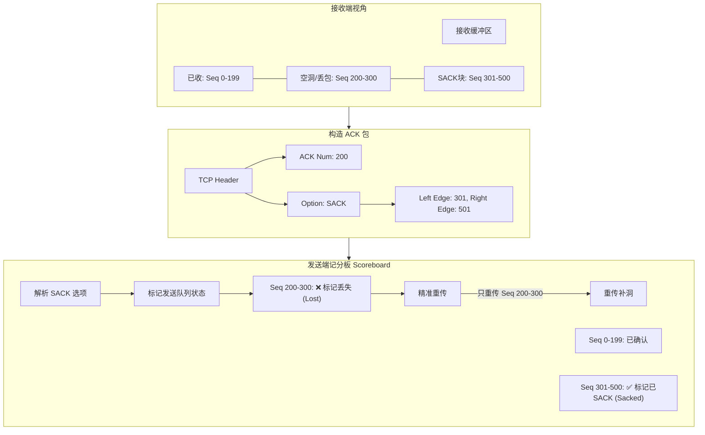

[⬆️ 返回目录](#catalog)

## 重传

好的，作为一个资深程序员，我们重新梳理 TCP 重传机制。这次我修复了 Mermaid 图表中的语法兼容性问题，并保持深度的内核视角分析。

在内核开发者的眼中，**TCP 重传（Retransmission）** 并不是简单的“丢了就补发”，而是**拥塞控制（Congestion Control）状态机切换的“扳机”**。它决定了连接是进入“慢启动（Slow Start）”还是“快速恢复（Fast Recovery）”，这对高并发服务的延时抖动（Jitter）有决定性影响。

以下是完整的深度解析及修复后的流程图。

---

### 一、 超时重传 (RTO) —— 性能的“核打击”

**资深视角**：
超时重传（RTO - Retransmission Timeout）是 TCP 的底线兜底机制。一旦触发 RTO，TCP 协议栈会认为当前网络发生了极其严重的拥塞（连 Dup ACK 都传不回来了）。

**内核行为**：
1.  **重置 cwnd**：拥塞窗口（cwnd）直接降为 1 个 MSS（回到解放前）。
2.  **慢启动**：进入 Slow Start 阶段，带宽利用率断崖式下跌。
3.  **指数退避**：如果重传包还丢，下一次 RTO 时间翻倍（1s -> 2s -> 4s ...）。

**修复后的流程图**：

---

### 二、 快速重传 (Fast Retransmit) —— 性能的“急救包”

**资深视角**：
快速重传通过检测**重复 ACK (Duplicate ACK)** 来感知丢包。这通常意味着“包丢了，但路没断”（部分数据包还能到达）。

**内核行为**：
1.  **触发阈值**：通常收到 **3 个** 重复的 ACK（冗余 ACK）。为什么是 3 个？为了过滤掉因为网络路由导致的**乱序（Reordering）**。
2.  **快速恢复**：TCP **不会**像 RTO 那样回到慢启动。它会将 `cwnd` 减半（`ssthresh = cwnd/2`），然后进入 **Fast Recovery** 状态。这是为了保住当前的发送速率。

**修复后的时序图**：

---

### 三、 SACK (Selective ACK) —— 现代化的精准补发

**资深视角**：
传统的重传机制（Go-Back-N）非常笨拙。假设发送了 1~10，只有 2 丢了。接收方只能一直 ACK 2。发送方不知道 3~10 到了没，可能一气之下把 2~10 全重发了（浪费带宽），或者只重发 2（增加延迟）。

**内核行为**：
SACK 在 TCP 头部的 Option 字段里携带了“我收到的不连续块”。发送方维护一个 **记分板 (Scoreboard)**，精准标记哪些包丢了，只重传丢失的部分。

**修复后的逻辑图**：

---

### 四、 总结：资深程序员的调优结论

1.  **区分 RTO 与 Fast Retransmit**：
    *   我们在监控看板上看到 `TcpRetransSegs` 增加时，不要惊慌。如果是 **Fast Retransmit** 增加，说明带宽可能跑满了或者偶尔有丢包，系统还在撑着。
    *   但如果看到 **TCP Timeouts** 增加，说明网络环境恶化，或者中间链路丢包严重，系统吞吐量即将崩盘。

2.  **SACK 必须开**：
    *   `sysctl net.ipv4.tcp_sack` 默认为 1。如果被误关，高丢包率环境下（如跨国传输、弱网 WiFi）性能会下降 50% 以上。

3.  **Linux 的 RACK 优化**：
    *   现在的 Linux 内核（4.4+）已经默认启用了 **RACK (Recent ACK)** 算法，它不再单纯依赖“3个重复 ACK”，而是根据**时间戳**来判断丢包。这解决了“尾部丢包”无法触发快速重传的痛点（因为尾部丢包后，没有后续的包来触发 Dup ACK）。

<!-- 跳转链接 -->
[⬆️ 返回目录](#catalog)  |  [文章开头 ➡️](#chap-retransmit)