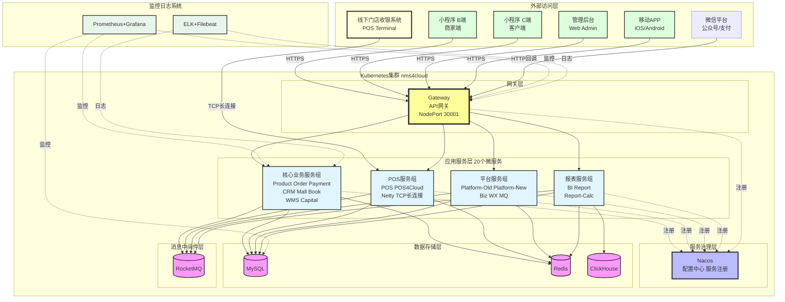
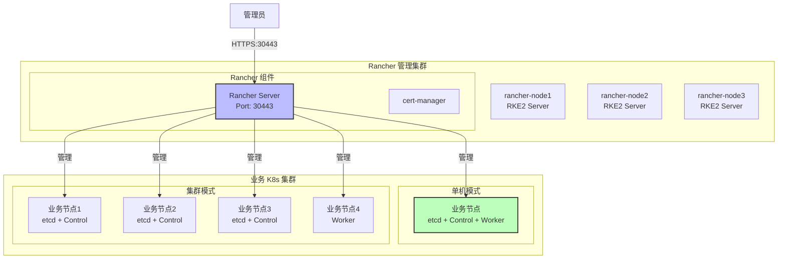
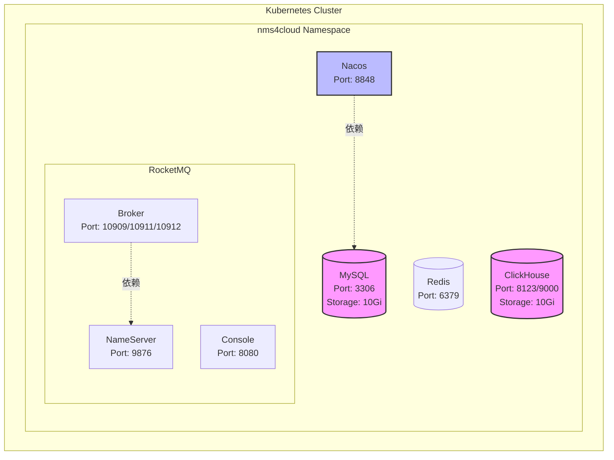
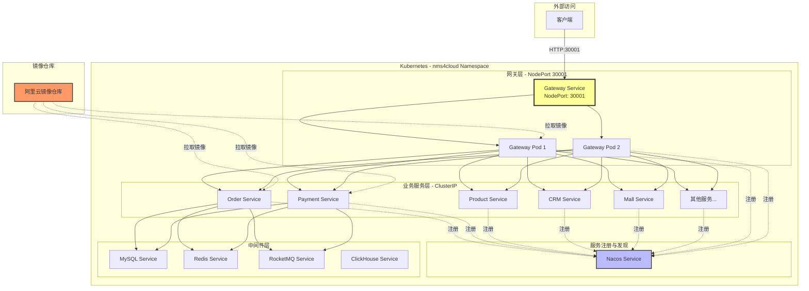

# 微服务部署手册

## 1. 概述

### 1.1 文档说明

本文档面向运维工程师和开发团队，提供 nms4cloud 微服务系统的完整部署指南。读者通过本文档可以：

- 从零开始搭建 Rancher + Kubernetes 环境
- 部署所有必需的中间件（MySQL、Redis、RocketMQ、ClickHouse、Nacos）
- 构建并部署 20 个微服务
- 配置监控和日志系统
- 掌握日常运维操作（更新、回滚、故障排查）

**适用环境**：测试环境
**部署模式**：支持单机模式和集群模式

### 1.2 系统架构

nms4cloud 是一个基于 Spring Cloud 的微服务架构系统，采用 Kubernetes 容器化部署，通过 Rancher 进行集群管理。

#### 1.2.1 整体架构图（简化版）



**架构说明**：

**前端应用层**：

- **线下门店收银系统**：通过 TCP 长连接直接连接到 Netty 模块，实现实时通信
- **小程序 B端（商家端）**：商家管理小程序，通过 HTTPS 访问网关
- **小程序 C端（客户端）**：用户购物小程序，通过 HTTPS 访问网关
- **管理后台**：Web 管理系统，通过 HTTPS 访问网关
- **移动APP**：iOS/Android 应用，通过 HTTPS 访问网关
- **微信平台**：微信公众号、微信支付回调，通过 HTTP 访问网关

**服务分组**：

- **核心业务服务组**（8个）：Product（产品）、Order（订单）、Payment（支付）、CRM（会员）、Mall（商城）、Book（预订）、WMS（仓库供应链）、Capital（账号）
- **POS服务组**（3个）：POS（POS模块）、POS4Cloud（收银系统）、Netty（POS消息中转，处理TCP长连接）
- **平台服务组**（5个）：Platform-Old（平台旧版）、Platform-New（平台新版）、Biz（业务）、WX（微信对接）、MQ（消息接入）
- **报表服务组**（3个）：BI（报表旧版）、Report（报表新版）、Report-Calc（报表计算）

**技术架构**：

- 网关统一入口，通过 NodePort 30001 对外暴露
- 线下门店收银系统通过 TCP 长连接直接连接 Netty 模块，不经过网关
- 所有前端应用（小程序、管理后台、APP）通过 HTTPS 访问网关
- 所有服务注册到 Nacos 进行服务发现
- 所有服务连接 MySQL、Redis、RocketMQ
- 报表服务额外连接 ClickHouse
- Prometheus+Grafana 提供监控
- ELK+Filebeat 提供日志收集

详细的服务清单请参考下方的"微服务清单"表格。

### 1.3 微服务清单

| 服务名称                       | 功能说明                       | 端口  | 依赖中间件                                |
| ------------------------------ | ------------------------------ | ----- | ----------------------------------------- |
| gateway                        | 网关服务，统一入口             | 30001 | Nacos, Redis                              |
| a00-nms4cloud-product          | 产品模块                       | 80    | MySQL, Redis, RocketMQ, Nacos             |
| a00-nms4cloud-biz              | 业务模块                       | 80    | MySQL, Redis, RocketMQ, Nacos             |
| a00-nms4cloud-book             | 预订模块                       | 80    | MySQL, Redis, RocketMQ, Nacos             |
| a00-nms4cloud-crm              | 会员模块                       | 80    | MySQL, Redis, RocketMQ, Nacos             |
| a00-nms4cloud-mall             | 商城模块                       | 80    | MySQL, Redis, RocketMQ, Nacos             |
| a00-nms4cloud-order            | 订单模块                       | 80    | MySQL, Redis, RocketMQ, Nacos             |
| a00-nms4cloud-payment          | 支付模块                       | 80    | MySQL, Redis, RocketMQ, Nacos             |
| a00-nms4cloud-pos              | POS 模块                       | 80    | MySQL, Redis, RocketMQ, Nacos             |
| a00-nms4cloud-pos4cloud        | 收银系统模块                   | 80    | MySQL, Redis, RocketMQ, Nacos             |
| a00-nms4cloud-wms              | 仓库供应链模块                 | 80    | MySQL, Redis, RocketMQ, Nacos             |
| a00-nmscloud-wx                | 微信对接模块                   | 80    | MySQL, Redis, RocketMQ, Nacos             |
| a00-yd4cloud-capital           | 账号模块（挂账）               | 80    | MySQL, Redis, RocketMQ, Nacos             |
| a00-nms4cloud-platform         | 平台模块（旧版）               | 80    | MySQL, Redis, RocketMQ, Nacos             |
| a00-yd4cloud-platform          | 平台模块（新版）               | 80    | MySQL, Redis, RocketMQ, Nacos             |
| a00-nms4cloud-bi               | 报表模块（旧版）               | 80    | MySQL, Redis, RocketMQ, ClickHouse, Nacos |
| a00-nms4cloud-pos11report      | 报表模块（新版，对外接口）     | 80    | MySQL, Redis, RocketMQ, ClickHouse, Nacos |
| a00-nms4cloud-pos11report-calc | 报表计算模块（新版，内部计算） | 80    | MySQL, Redis, RocketMQ, ClickHouse, Nacos |
| a00-nms4cloud-mq               | 消息接入模块                   | 80    | MySQL, Redis, RocketMQ, Nacos             |
| a00-nms4cloud-netty            | POS 消息中转模块               | 80    | MySQL, Redis, RocketMQ, Nacos             |

### 1.4 技术栈

**容器编排**：

- Kubernetes（通过 RKE2）
- Rancher 2.x（集群管理）

**微服务框架**：

- Spring Boot 2.x / 3.x
- Spring Cloud（服务治理）
- Nacos（配置中心 + 服务注册）

**中间件**：

- MySQL 8.0（关系数据库）
- Redis 7.0（缓存）
- RocketMQ 5.x（消息队列）
- ClickHouse 23.x（列式数据库）

**监控日志**：

- Prometheus + Grafana（监控）
- ELK Stack（日志）
- Filebeat（日志采集）

**镜像仓库**：

- 阿里云容器镜像服务

### 1.5 部署流程概览


### 1.6 资源规划

#### 1.6.1 单机模式资源需求

| 组件类型       | CPU      | 内存     | 磁盘      |
| -------------- | -------- | -------- | --------- |
| 中间件         | 4核      | 8GB      | 50GB      |
| 微服务（20个） | 24核     | 48GB     | 20GB      |
| 监控日志       | 4核      | 8GB      | 50GB      |
| **总计**       | **32核** | **64GB** | **120GB** |

#### 1.6.2 集群模式资源需求

**中间件节点（3个）**：每个节点 4核 8GB 50GB
**微服务节点（3个）**：每个节点 8核 16GB 50GB
**监控节点（1个）**：4核 8GB 50GB

## 2. 部署前准备

### 2.1 环境要求

#### 2.1.1 硬件要求

**Rancher 管理集群（至少3个节点）：**

- CPU: 4核心
- 内存: 8GB
- 磁盘: 100GB
- 网络: 内网互通

**业务 K8s 集群（根据实际需求）：**

- 单机模式: CPU 8核心，内存 16GB，磁盘 200GB
- 集群模式: 每个节点 CPU 8核心，内存 16GB，磁盘 200GB（建议至少3个节点）

#### 2.1.2 软件要求

- 操作系统: CentOS 7.9 或 CentOS Stream 8+
- 内核版本: 3.10+ (建议 4.18+)
- 禁用 SELinux
- 禁用 Swap
- 配置时间同步

#### 2.1.3 网络要求

**端口开放清单：**

| 协议 | 端口      | 源       | 目标         | 用途                |
| ---- | --------- | -------- | ------------ | ------------------- |
| TCP  | 22        | 管理员   | 所有节点     | SSH                 |
| TCP  | 80        | 用户     | Rancher 节点 | HTTP                |
| TCP  | 443       | 用户     | Rancher 节点 | HTTPS               |
| TCP  | 6443      | K8s 节点 | K8s 节点     | Kubernetes API      |
| TCP  | 9345      | K8s 节点 | K8s 节点     | RKE2 Supervisor API |
| TCP  | 2379-2380 | K8s 节点 | K8s 节点     | etcd                |
| UDP  | 8472      | K8s 节点 | K8s 节点     | Flannel VXLAN       |
| TCP  | 10250     | K8s 节点 | K8s 节点     | Kubelet             |

### 2.2 节点准备

以下操作需要在**所有节点**上执行。

#### 2.2.1 配置主机名和 hosts

```bash
# 设置主机名（每个节点设置不同的名称）
hostnamectl set-hostname rancher-node1  # 第一个节点
hostnamectl set-hostname rancher-node2  # 第二个节点
hostnamectl set-hostname rancher-node3  # 第三个节点

# 配置 /etc/hosts（所有节点相同）
cat >> /etc/hosts << EOF
192.168.1.101 rancher-node1
192.168.1.102 rancher-node2
192.168.1.103 rancher-node3
EOF
```

#### 2.2.2 关闭防火墙和 SELinux

```bash
# 关闭防火墙

# 查看 ufw 状态
sudo ufw status
# 临时关闭
sudo ufw stop
# 永久禁用
sudo ufw disable

# 从内核级别彻底关闭 Ubuntu 的 AppArmor 安全模块。
# 它类似于在 CentOS 中将 SELinux 从 enforcing 改为 disabled。在 Ubuntu 环境下，AppArmor 是默认的安全加固工具，但它有时会拦截 Kubernetes (K8s) 或 Rancher 的一些底层操作（如容器挂载、网络转发等），导致权限错误。


# 查看状态
sudo aa-status
# 修改 grub 配置，在启动参数中加入 apparmor=0
sudo sed -i 's/GRUB_CMDLINE_LINUX_DEFAULT="/&apparmor=0 /' /etc/default/grub

# 更新 grub 并重启
sudo update-grub
sudo reboot

# 验证
cat /sys/module/apparmor/parameters/enabled

# apparmor module is loaded.: 虽然 AppArmor 的内核模块存在于内存中，但这只是表示内核支持这个功能。
# • apparmor filesystem is not mounted.: 关键在于这一句。AppArmor 需要挂载特定的安全文件系统来管理和应用规则。如果它没有挂载，意味着 AppArmor 无法下发任何指令，所有的安全限制（Enforcement）都不会生效。
# • 如果返回 N：说明已经彻底关闭，你可以放心地安装 Rancher/K8s 了。
# • 如果返回 Y：虽然上面显示 filesystem 未挂载，但内核功能还是开启的。

```

#### 2.2.3 关闭 Swap

```bash

# 在安装 Kubernetes (K8s) 或 Rancher 时，禁用 Swap（交换分区）是一个强制性或强力建议的操作。
# 主要原因可以总结为以下几点：
# 1. 性能的不确定性 (Predictability)
# Kubernetes 的设计理念是精细化管理资源。
# • 内存 vs 磁盘：内存（RAM）的读写速度比磁盘（即使是 NVMe SSD）快数千倍。
# • 延迟问题：如果允许使用 Swap，当物理内存不足时，系统会将数据写入磁盘。这会导致 Pod 的运行速度突然大幅下降，且产生难以调试的延迟（Latency）。
# • 无法保证 QoS：K8s 有三种服务质量（Guaranteed, Burstable, BestEffort）。如果开启了 Swap，K8s 很难准确评估一个 Pod 到底使用了多少“真实内存”，从而无法保证承诺的性能。
# 2. 资源调度的复杂性 (Scheduler Logic)
# K8s 的调度器（Scheduler）在决定把 Pod 放到哪个节点时，会计算节点的可用资源。
# • 调度器只计算物理内存。
# • 如果开启了 Swap，节点看起来会有比物理内存更多的“虚拟内存”。这会诱导调度器将过多的 Pod 挤在一个节点上，导致物理内存耗尽，最终触发整个节点的性能雪崩。
# 3. Kubelet 的管理机制
# kubelet 是运行在每个节点上的代理，它负责监控内存并在压力大时“驱逐”（Evict）Pod 以保护节点。
# • OOM 风险：如果开启了 Swap，系统的 Linux 内核可能会在 kubelet 察觉到压力之前，就开始把数据往 Swap 里挪。
# • 反应迟钝：kubelet 无法准确判断什么时候该驱逐 Pod 来保护系统，因为 Swap 掩盖了真实的内存压力，直到整个系统因为磁盘 IO 过高而卡死。
# 4. 历史原因与社区标准
# • 在 K8s 早期，开发团队决定不支持 Swap，这样可以简化代码实现并确保高可用的集群环境。
# • 直到最近的 K8s 版本（v1.22+）才开始实验性地支持 Swap（但配置极其复杂且不推荐新手使用）。对于生产环境和大多数 Rancher 部署，关闭 Swap 依然是行业标准。QoS：K8s 有三种服务质量（Guaranteed, Burstable, BestEffort）。如果开启了 Swap，K8s 很难准确评估一个 Pod 到底使用了多少“真实内存”，从而无法保证承诺的性能。


# 无论是在 CentOS 还是 Ubuntu，执行完后都可以通过以下命令确认 Swap 是否已关闭（数值应全部为 0）：
free -h
# 或者
swapon --show

# 临时关闭
swapoff -a

# 永久关闭

sed -i 's/^\(.*swap.*\)$/#\1/' /etc/fstab

# 检查

# 在 Ubuntu 上修改完 fstab 后，请务必执行以下两步验证：
# 第一步：检查文件内容
# 查看是否真的加上了 #：
cat /etc/fstab | grep swap
# 预期输出（示例）： #/swap.img none swap sw 0 0
# 第二步：确认当前 Swap 已关闭
# sed 只是保证下次重启不开启。要让当前立即生效，还需执行：

free -h  # 确认 Swap 栏全部为 0


```

#### 2.2.4 配置内核参数

```bash
# 1. 创建模块配置文件，确保重启后自动加载
cat <<EOF | sudo tee /etc/modules-load.d/k8s.conf
overlay
br_netfilter
EOF

# 2. 立即手动加载模块
sudo modprobe overlay
sudo modprobe br_netfilter


# 3. 写入 sysctl 配置
cat <<EOF | sudo tee /etc/sysctl.d/k8s.conf
net.bridge.bridge-nf-call-iptables  = 1
net.bridge.bridge-nf-call-ip6tables = 1
net.ipv4.ip_forward                 = 1
vm.swappiness                       = 0
EOF

# 4. 使配置立即生效
sudo sysctl --system


# 检查模块是否加载
lsmod | grep br_netfilter

# 检查参数是否生效  输出应显示对应的值为 1。
sysctl net.bridge.bridge-nf-call-iptables net.ipv4.ip_forward


```

#### 2.2.5 配置时间同步

```bash
# 安装 chrony
sudo apt update
sudo apt install -y chrony

# 启动并设置开机自启
# 启动服务
sudo systemctl start chrony

# 设置开机自启
sudo systemctl enable chrony

# 验证时间同步
chronyc sources -v


# 立即步进式校准（如果时间差太多，强制跳回正确时间）
sudo chronyc -a makestep

# 时区 (Time Zone)
# 从截图看到，你的时区目前是 Etc/UTC。
# 如果你在中国，建议将其修改为北京时间，否则 Rancher/Kubernetes 的日志时间会和你本地时间差 8 小时，排查问题会非常痛苦。
# 修改为上海时区：
# 修改时区为上海（北京时间）
sudo timedatectl set-timezone Asia/Shanghai

# 验证
timedatectl


# Ubuntu 环境下的注意事项
# 1. 与 systemd-timesyncd 的冲突
# Ubuntu 默认带有一个轻量级的时间同步服务 systemd-timesyncd。
# • 当你安装 chrony 时，Ubuntu 通常会自动禁用 systemd-timesyncd 以防冲突。
# • 你可以运行 timedatectl status 来检查。如果看到 NTP service: active，说明同步正在工作。
# 2. 配置文件路径
# • CentOS: /etc/chrony.conf
# • Ubuntu: /etc/chrony/chrony.conf （多了一个层级）
# 如果你需要修改时间服务器（例如使用阿里云或腾讯云的 NTP），你需要编辑：
# sudo nano /etc/chrony/chrony.conf

# systemctl status systemd-timesyncd
# (你应该看到 inactive (dead) 或者是 ConditionCheckError，这说明它已经自动让位了)


```

### 2.3 安装 RKE2（Rancher 管理集群）

RKE2 是 Rancher 推荐的新一代 Kubernetes 发行版，用于运行 Rancher 本身。

#### 2.3.1 安装第一个 Server 节点

在 `rancher-node1` 上执行：

```bash
# 下载并安装 RKE2
curl -sfL https://get.rke2.io | sh -

# 创建配置文件
mkdir -p /etc/rancher/rke2

#如果有移动服务器导致ip变化的情况，因为证书是在rke2-server服务启动时生成的， 所以这里的服务器名不要变化。不要写ip。可以写
# tls-san:
#   - "jjtestserver"
#   - "localhost"
#   - "127.0.0.1"

cat > /etc/rancher/rke2/config.yaml << EOF
write-kubeconfig-mode: "0644"
tls-san:
  - rancher-node1
  - 192.168.1.101
cluster-cidr: 10.42.0.0/16
service-cidr: 10.43.0.0/16
EOF

# 启动 RKE2
systemctl enable rke2-server.service
systemctl start rke2-server.service

# 等待启动完成（可能需要几分钟）
journalctl -u rke2-server -f
```

如果服务器经常变动,参考下面的配置

```bash
# 1. 安装二进制文件
curl -sfL https://get.rke2.io | sudo sh -

# 2. 创建配置目录
sudo mkdir -p /etc/rancher/rke2

# 3. 写入针对“移动 IP”优化的配置
# 使用 sudo tee 确保即使在 root 目录下也能顺利写入
sudo cat <<EOF | sudo tee /etc/rancher/rke2/config.yaml
write-kubeconfig-mode: "0644"
tls-san:
  - "jjtestserver.local"
  - "jjtestserver"
  - "localhost"
  - "127.0.0.1"
cluster-cidr: 10.42.0.0/16
service-cidr: 10.43.0.0/16
EOF

# 4. 添加主机名
# jjtestserver.local是为了解决rancher初始化配置的问题,因为UI必须填写一个带后缀的网址, 如果没有域名，则rancher初始化配置就会失败。那么创建一个域名，并添加到/etc/hosts中。
# 原因在于 Rancher 的工作模式：它有很多内部组件（Pod）是运行在 Kubernetes 容器里的，这些组件经常需要“回头”访问 Rancher 自身。
# 为什么服务器自身也需要修改 hosts？
# 1. Agent 内部回环通讯：
# Rancher 会在你的 RKE2 上启动一个叫 cattle-cluster-agent 的 Pod。这个 Pod 会尝试连接你设置的 Server URL (https://jjtestserver.local)。
# 如果服务器自身的 /etc/hosts 里没有这个域名，这个 Pod 就会解析失败，导致 Rancher 界面显示集群一直处于 Pending（待定）状态。
# 2. CoreDNS 继承：
# Kubernetes 内部的域名解析服务 (CoreDNS) 默认会读取宿主机的 /etc/hosts。所以你在服务器上改了，容器内部也就自动懂了。
nano vi /etc/hosts

# 或者不修改主机名，直接 mDNS (多播 DNS)
sudo apt update && sudo apt install avahi-daemon -y
sudo systemctl enable avahi-daemon && sudo systemctl start avahi-daemon
sudo hostnamectl set-hostname jjtestserver

# 优点：
# 全自动： 无论服务器换到哪个路由器下，IP 怎么变，你都不需要改任何地方。
# 免配置： Windows (10及以上)、Mac、iOS 默认都支持 mDNS。
# 局限性： 仅限同一个局域网内有效（跨网段通常不行）。


# 5. 添加下面一行
127.0.0.1  jjtestserver.local

# 4. 启动 RKE2 并设置为开机自启
sudo systemctl enable rke2-server.service
sudo systemctl start rke2-server.service

# 5. 实时查看启动日志 (看到 "Running kubelet" 表示快成功了)
sudo journalctl -u rke2-server -f

```

上面的jjtestserver.local是为了解决下面的rancher初始化的问题,这里的sever url必须填写一个后缀。否则无法保存。


#### 2.3.2 配置 kubectl

```bash
# 配置环境变量
cat >> ~/.bashrc << EOF
export PATH=\$PATH:/var/lib/rancher/rke2/bin
export KUBECONFIG=/etc/rancher/rke2/rke2.yaml
EOF

source ~/.bashrc

# 验证集群状态
kubectl get nodes
```

#### 2.3.3 获取 Token

```bash
# 获取 Token（后续节点加入需要）
cat /var/lib/rancher/rke2/server/node-token
```

#### 2.3.4 加入其他 Server 节点

在 `rancher-node2` 和 `rancher-node3` 上执行：

```bash
# 下载并安装 RKE2
curl -sfL https://get.rke2.io | sh -

# 创建配置文件
mkdir -p /etc/rancher/rke2

cat > /etc/rancher/rke2/config.yaml << EOF
server: https://rancher-node1:9345
token: <从 rancher-node1 获取的 token>
write-kubeconfig-mode: "0644"
tls-san:
  - rancher-node2  # 或 rancher-node3
  - 192.168.1.102  # 或 192.168.1.103
EOF

# 启动 RKE2
systemctl enable rke2-server.service
systemctl start rke2-server.service

# 配置 kubectl
cat >> ~/.bashrc << EOF
export PATH=\$PATH:/var/lib/rancher/rke2/bin
export KUBECONFIG=/etc/rancher/rke2/rke2.yaml
EOF

source ~/.bashrc
```

#### 2.3.5 验证集群状态

在任意 Server 节点上执行：

```bash
# 查看节点状态
kubectl get nodes

# 应该看到3个节点都是 Ready 状态
# NAME            STATUS   ROLES                       AGE   VERSION
# rancher-node1   Ready    control-plane,etcd,master   10m   v1.28.x
# rancher-node2   Ready    control-plane,etcd,master   5m    v1.28.x
# rancher-node3   Ready    control-plane,etcd,master   5m    v1.28.x
```

### 2.4 安装 Helm

Helm 用于安装 Rancher。在 `rancher-node1` 上执行：

```bash
# 下载 Helm 安装脚本
curl https://raw.githubusercontent.com/helm/helm/main/scripts/get-helm-3 | bash

# 验证安装
helm version
```

### 2.5 安装 Rancher

#### 2.5.1 添加 Helm 仓库

```bash
# 检查仓库列表
helm repo list

# 添加 Rancher 稳定版仓库
helm repo add rancher-stable https://releases.rancher.com/server-charts/stable

# 更新仓库
helm repo update
```

#### 2.5.2 创建 Namespace

```bash
# cattle-system 是 Rancher 服务的专属命名空间，核心作用是 隔离 Rancher 自身的所有运行资源，避免与集群中其他应用（如你的 gateway 服务）的资源冲突，同时方便集中管理和维护 Rancher 相关组件，是部署 Rancher 的必需命名空间。
# 核心用途：存储 Rancher 运行的关键资源
# 创建后，cattle-system 会存放 Rancher 正常工作所需的所有核心组件，主要包括：
# Rancher Server 核心 Pod：Rancher 服务的主进程容器，负责提供 UI 界面、API 服务、集群管理逻辑；
# 认证与授权相关资源：存储 Rancher 管理员账号、集群接入密钥、证书（如 TLS 证书）的 Secret，以及配置文件 ConfigMap；
# 网络组件：Rancher 内置的 Ingress Controller（用于路由 UI/API 访问）、网络策略等；
# 依赖组件 Pod：如 Rancher 内置的监控、日志收集、集群代理（cluster-agent）等辅助组件。
# 关键意义：资源隔离与集中管控
# 避免冲突：将 Rancher 的组件与你的业务应用（如 nms4cloud 命名空间下的 gateway）分开，防止资源名称重复、权限混淆；
# 便于运维：后续升级、回滚、备份 Rancher 时，只需操作 cattle-system 命名空间，不影响其他业务；
# 权限隔离：可单独为 cattle-system 配置访问权限，保障 Rancher 服务的安全性（避免误操作删除核心组件）。
# 简单说：cattle-system 就是 Rancher 的 “专属工作目录”，所有与 Rancher 自身运行相关的资源都集中放在这里，是 Rancher 部署和运行的基础。

kubectl create namespace cattle-system

# 检查rancher命名空间是否存在
# 方式1：精准查询指定命名空间（推荐，最快）
kubectl get namespace cattle-system

# 方式2：简写命令（效果同上，更简洁）
kubectl get ns cattle-system

```

#### 2.5.3 安装 cert-manager

Rancher 需要 cert-manager 来管理证书。

```bash
# 安装 cert-manager CRDs
kubectl apply -f https://github.com/cert-manager/cert-manager/releases/download/v1.13.0/cert-manager.crds.yaml

# 添加 Jetstack Helm 仓库
helm repo add jetstack https://charts.jetstack.io
helm repo update

# 创建 namespace
kubectl create namespace cert-manager

# 安装 cert-manager
helm install cert-manager jetstack/cert-manager \
  --namespace cert-manager \
  --version v1.13.0

# 验证安装
kubectl get pods --namespace cert-manager
```

#### 2.5.4 安装 Rancher

```bash
# 安装 Rancher（使用自签名证书）
# 单机部署
helm install rancher rancher-stable/rancher \
  --namespace cattle-system \
  --set hostname=jjtestserver \
  --set replicas=1 \
  --set bootstrapPassword=admin


helm install rancher rancher-stable/rancher \
  --namespace cattle-system \
  --set hostname=rancher.example.com \
  --set replicas=3 \
  --set bootstrapPassword=admin

# 如果资料填写错误， 这样修改
# 使用 upgrade 命令更新配置
helm upgrade rancher rancher-stable/rancher \
  --namespace cattle-system \
  --set hostname=jjtestserver \
  --set replicas=1 \
  --set bootstrapPassword=admin

# 等待 Rancher 部署完成
kubectl -n cattle-system rollout status deploy/rancher

# 查看 Rancher Pod 状态
kubectl -n cattle-system get pods

# 获取 Rancher 初始登录密码
/var/lib/rancher/rke2/bin/kubectl --kubeconfig /etc/rancher/rke2/rke2.yaml -n cattle-system get secret bootstrap-secret -o go-template='{{.data.bootstrapPassword|base64decode}}{{"\n"}}'


# 1、如果你已经登录过并修改了密码，但现在忘记了，需要通过命令行强制重置 admin 密码

# 1.1 找到 Rancher 的 Pod ID
RANCHER_POD=$(/var/lib/rancher/rke2/bin/kubectl --kubeconfig /etc/rancher/rke2/rke2.yaml -n cattle-system get pods -l app=rancher -o jsonpath='{.items[0].metadata.name}')

# 1.2 执行重置命令 (将 NewPassword123 替换为你想要的新密码)
/var/lib/rancher/rke2/bin/kubectl --kubeconfig /etc/rancher/rke2/rke2.yaml -n cattle-system exec $RANCHER_POD -- reset-password

```

#### 2.5.5 暴露 Rancher 服务

```bash
# 创建 NodePort Service
kubectl -n cattle-system patch svc rancher -p '{"spec":{"type":"NodePort","ports":[{"port":443,"targetPort":443,"nodePort":30443}]}}'

# 查看服务
kubectl -n cattle-system get svc rancher
```

#### 2.5.6 访问 Rancher

1. 在浏览器中访问：`https://<任意节点IP>:30443`
2. 首次访问会提示设置管理员密码（如果之前设置了 bootstrapPassword，使用该密码登录）
3. 登录后会要求设置 Rancher Server URL

**注意**：由于使用自签名证书，浏览器会提示不安全，选择"继续访问"即可。

### 2.6 通过 Rancher 创建业务 K8s 集群

#### 2.6.1 准备业务集群节点

准备用于运行微服务的节点（单机或多节点），执行 2.2 节中的所有节点准备步骤。

#### 2.6.2 在 Rancher 中创建集群

1. 登录 Rancher 控制台
2. 点击右上角"创建"按钮
3. 选择"Custom"（自定义集群）
4. 配置集群信息：
   - **集群名称**：`nms4cloud-cluster`
   - **Kubernetes 版本**：选择最新稳定版
   - **网络插件**：Flannel（默认）
   - **云提供商**：None

5. 点击"下一步"，Rancher 会生成节点注册命令

#### 2.6.3 注册节点

**单机模式**：
在业务节点上执行 Rancher 生成的命令，选择所有角色（etcd、Control Plane、Worker）：

```bash
# 示例命令（实际命令从 Rancher 界面复制）
sudo docker run -d --privileged --restart=unless-stopped \
  --net=host -v /etc/kubernetes:/etc/kubernetes \
  -v /var/run:/var/run rancher/rancher-agent:v2.x.x \
  --server https://rancher.example.com:30443 \
  --token <token> \
  --ca-checksum <checksum> \
  --etcd --controlplane --worker
```

**集群模式**：

- 在3个节点上执行命令，选择 etcd + Control Plane 角色
- 在其他节点上执行命令，只选择 Worker 角色

#### 2.6.4 等待集群就绪

在 Rancher 控制台中监控集群状态，等待所有节点变为 Active 状态（可能需要5-10分钟）。

#### 2.6.5 配置 kubectl 访问

1. 在 Rancher 控制台中，进入创建的集群
2. 点击右上角"Kubeconfig 文件"
3. 复制内容并保存到本地 `~/.kube/config`
4. 验证访问：

```bash
kubectl get nodes
```

### 2.7 创建业务命名空间

```bash
# 创建 nms4cloud 命名空间
kubectl create namespace nms4cloud

# 验证
kubectl get namespaces
```

### 2.8 配置镜像仓库访问

#### 2.8.1 配置阿里云镜像仓库凭证

```bash
# 创建 Docker Registry Secret
kubectl create secret docker-registry aliyun-registry \
  --docker-server=registry.cn-hangzhou.aliyuncs.com \
  --docker-username=<阿里云账号> \
  --docker-password=<阿里云密码> \
  --namespace=nms4cloud

# 验证
kubectl get secret -n nms4cloud
```

#### 2.8.2 镜像命名规范建议

建议使用以下镜像命名规范：

```
registry.cn-hangzhou.aliyuncs.com/<命名空间>/<服务名>:<版本号>
```

**示例：**

```
registry.cn-hangzhou.aliyuncs.com/nms4cloud/gateway:1.0.0
registry.cn-hangzhou.aliyuncs.com/nms4cloud/a00-nms4cloud-order:1.0.0
```

**版本号规范：**

- 使用语义化版本：`主版本号.次版本号.修订号`
- 开发版本：`1.0.0-dev`
- 测试版本：`1.0.0-test`
- 生产版本：`1.0.0`
- 也可以使用 Git commit hash：`1.0.0-abc1234`

### 2.9 部署前检查清单

在开始部署中间件和微服务之前，请确认：

- [ ] 所有节点已完成基础配置（主机名、hosts、防火墙、SELinux、Swap、内核参数、时间同步）
- [ ] RKE2 管理集群已成功部署（3个节点都是 Ready 状态）
- [ ] Rancher 已成功安装并可以访问
- [ ] 业务 K8s 集群已通过 Rancher 创建完成
- [ ] 所有业务集群节点状态为 Active
- [ ] nms4cloud 命名空间已创建
- [ ] 阿里云镜像仓库凭证已配置
- [ ] kubectl 可以正常访问业务集群

```bash
# 一键检查命令
kubectl get nodes
kubectl get namespaces
kubectl get secret -n nms4cloud
```

### 2.10 部署架构图



## 3. 中间件部署

### 3.1 概述

本章节介绍系统所需中间件的部署流程。所有中间件均采用单节点部署方式，适用于测试环境。部署方式为通过 YAML 文件在 Rancher 中创建资源。

**中间件清单：**

- MySQL 5.7+ - 关系型数据库
- Redis 6.0+ - 缓存和消息队列
- RocketMQ 4.9+ - 消息中间件
- ClickHouse 22.0+ - 列式数据库
- Nacos 2.0+ - 配置中心和服务注册中心

**部署顺序建议：**
建议按照以下顺序部署中间件，确保依赖关系正确：

1. MySQL
2. Redis
3. ClickHouse
4. RocketMQ
5. Nacos

### 安装存储类

```bash
# 部署local-path存储类
kubectl apply -f https://raw.githubusercontent.com/rancher/local-path-provisioner/v0.0.30/deploy/local-path-storage.yaml
# 验证local-path存储类是否安装成功
kubectl get sc
# PVC 是否成功绑定
kubectl get pvc -n nms4cloud
```

### 3.2 MySQL 部署

#### 3.2.1 创建持久化卷声明（PVC）

```bash
检查存储类是否存在
kubectl get pods -n kube-system | grep local-path
如果不存在，请创建存储类

```

```yaml
apiVersion: v1
kind: PersistentVolumeClaim
metadata:
  name: mysql-pvc
  namespace: nms4cloud
spec:
  accessModes:
    - ReadWriteOnce
  resources:
    requests:
      storage: 10Gi
  storageClassName: local-path
```

#### 3.2.2 创建 MySQL Deployment

```yaml
apiVersion: apps/v1
kind: Deployment
metadata:
  name: mysql
  namespace: nms4cloud
spec:
  replicas: 1
  selector:
    matchLabels:
      app: mysql
  template:
    metadata:
      labels:
        app: mysql
    spec:
      containers:
        - name: mysql
          image: mysql:8.0
          env:
            - name: MYSQL_ROOT_PASSWORD
              value: "st11338"
            - name: MYSQL_CHARACTER_SET_SERVER
              value: "utf8mb4"
            - name: MYSQL_COLLATION_SERVER
              value: "utf8mb4_unicode_ci"
          ports:
            - containerPort: 3306
              name: mysql
          volumeMounts:
            - name: mysql-storage
              mountPath: /var/lib/mysql
          resources:
            requests:
              memory: "1Gi"
              cpu: "500m"
            limits:
              memory: "2Gi"
              cpu: "1000m"
      volumes:
        - name: mysql-storage
          persistentVolumeClaim:
            claimName: mysql-pvc

# 开启hostPort， 确保物理机没有开启3306端口
apiVersion: apps/v1
kind: Deployment
metadata:
  name: mysql
  namespace: nms4cloud
spec:
  replicas: 1
  selector:
    matchLabels:
      app: mysql
  template:
    metadata:
      labels:
        app: mysql
    spec:
      containers:
        - name: mysql
          image: mysql:8.0
          env:
            - name: MYSQL_ROOT_PASSWORD
              value: "st11338"
            - name: MYSQL_CHARACTER_SET_SERVER
              value: "utf8mb4"
            - name: MYSQL_COLLATION_SERVER
              value: "utf8mb4_unicode_ci"
          ports:
            - containerPort: 3306
              hostPort: 3306      # <--- 仅添加这一行
              name: mysql
          volumeMounts:
            - name: mysql-storage
              mountPath: /var/lib/mysql
          resources:
            requests:
              memory: "1Gi"
              cpu: "500m"
            limits:
              memory: "2Gi"
              cpu: "1000m"
      volumes:
        - name: mysql-storage
          persistentVolumeClaim:
            claimName: mysql-pvc

```

#### 3.2.3 创建 MySQL Service

```yaml
apiVersion: v1
kind: Service
metadata:
  name: mysql
  namespace: nms4cloud
spec:
  type: ClusterIP
  ports:
    - port: 3306
      targetPort: 3306
      hostPort: 3306
      protocol: TCP
  selector:
    app: mysql
```

#### 3.2.4 部署验证

```bash
# 查看 Pod 状态
kubectl get pods -n nms4cloud | grep mysql

# 进入 MySQL 容器验证
kubectl exec -it <mysql-pod-name> -n nms4cloud -- mysql -uroot -p

# 验证字符集
mysql> SHOW VARIABLES LIKE 'character%';
```

### 3.3 Redis 部署

#### 3.3.1 创建 Redis Deployment

```yaml
apiVersion: apps/v1
kind: Deployment
metadata:
  name: redis
  namespace: nms4cloud
spec:
  replicas: 1
  selector:
    matchLabels:
      app: redis
  template:
    metadata:
      labels:
        app: redis
    spec:
      containers:
        - name: redis
          image: redis:7.0
          command:
            - redis-server
            - --appendonly
            - "yes"
            - --requirepass
            - "123456" # <--- 核心修改：设置 Redis 密码
            - --maxmemory
            - 1gb
            - --maxmemory-policy
            - allkeys-lru
          ports:
            - containerPort: 6379
              hostPort: 6379 # <--- 映射到宿主机的 6379 端口
              name: redis
          resources:
            requests:
              memory: "512Mi"
              cpu: "250m"
            limits:
              memory: "1Gi"
              cpu: "500m"
```

#### 3.3.2 创建 Redis Service

```yaml
apiVersion: v1
kind: Service
metadata:
  name: redis
  namespace: nms4cloud
spec:
  type: ClusterIP
  ports:
    - port: 6379
      targetPort: 6379
      protocol: TCP
  selector:
    app: redis
```

#### 3.3.3 部署验证

```bash
# 查看 Pod 状态
kubectl get pods -n nms4cloud | grep redis

# 进入 Redis 容器验证
kubectl exec -it <redis-pod-name> -n nms4cloud -- redis-cli ping
# 应返回 PONG
```

### 3.4 RocketMQ 部署

#### 3.4.1 创建 NameServer Deployment

```yaml
apiVersion: apps/v1
kind: Deployment
metadata:
  name: rocketmq-nameserver
  namespace: nms4cloud
spec:
  replicas: 1
  selector:
    matchLabels:
      app: rocketmq-nameserver
  template:
    metadata:
      labels:
        app: rocketmq-nameserver
    spec:
      containers:
        - name: nameserver
          image: apache/rocketmq:5.1.0
          command: ["sh", "mqnamesrv"]
          ports:
            - containerPort: 9876
              hostPort: 9876 # <--- 仅添加这一行-             -
              name: nameserver
          env:
            - name: JAVA_OPT_EXT
              value: "-Xms512m -Xmx512m"
          resources:
            requests:
              memory: "512Mi"
              cpu: "250m"
            limits:
              memory: "1Gi"
              cpu: "500m"
```

#### 3.4.2 创建 NameServer Service

```yaml
apiVersion: v1
kind: Service
metadata:
  name: rocketmq-nameserver
  namespace: nms4cloud
spec:
  type: ClusterIP
  ports:
    - port: 9876
      targetPort: 9876
      protocol: TCP
  selector:
    app: rocketmq-nameserver
```

#### 3.4.3 创建 Broker Deployment

```yaml
apiVersion: apps/v1
kind: Deployment
metadata:
  name: rocketmq-broker
  namespace: nms4cloud
spec:
  replicas: 1
  selector:
    matchLabels:
      app: rocketmq-broker
  template:
    metadata:
      labels:
        app: rocketmq-broker
    spec:
      containers:
        - name: broker
          image: apache/rocketmq:5.1.0
          command: ["sh", "mqbroker", "-n", "rocketmq-nameserver:9876"]
          ports:
            - containerPort: 10909
              hostPort: 10909 # <--- 仅添加这一行-                     -
              name: vip
            - containerPort: 10911
              hostPort: 10911 # <--- 仅添加这一行-
              name: main
            - containerPort: 10912
              hostPort: 10912 # <--- 仅添加这一行-
              name: ha
          env:
            - name: JAVA_OPT_EXT
              value: "-Xms1g -Xmx1g"
          resources:
            requests:
              memory: "1Gi"
              cpu: "500m"
            limits:
              memory: "2Gi"
              cpu: "1000m"
```

#### 3.4.4 创建 Broker Service

```yaml
apiVersion: v1
kind: Service
metadata:
  name: rocketmq-broker
  namespace: nms4cloud
spec:
  type: ClusterIP
  ports:
    - port: 10909
      targetPort: 10909
      name: vip
      protocol: TCP
    - port: 10911
      targetPort: 10911
      name: main
      protocol: TCP
    - port: 10912
      targetPort: 10912
      name: ha
      protocol: TCP
  selector:
    app: rocketmq-broker
```

#### 3.4.5 部署 RocketMQ 控制台（可选）

```yaml
apiVersion: apps/v1
kind: Deployment
metadata:
  name: rocketmq-console
  namespace: nms4cloud
spec:
  replicas: 1
  selector:
    matchLabels:
      app: rocketmq-console
  template:
    metadata:
      labels:
        app: rocketmq-console
    spec:
      containers:
        - name: console
          image: apacherocketmq/rocketmq-console:2.0.0
          ports:
            - containerPort: 8080
              hostPort: 8080 # <--- 仅添加这一行-                 -
              name: console
          env:
            - name: JAVA_OPTS
              value: "-Drocketmq.namesrv.addr=rocketmq-nameserver:9876 -Dcom.rocketmq.sendMessageWithVIPChannel=false"
          resources:
            requests:
              memory: "512Mi"
              cpu: "250m"
            limits:
              memory: "1Gi"
              cpu: "500m"
---
apiVersion: v1
kind: Service
metadata:
  name: rocketmq-console
  namespace: nms4cloud
spec:
  type: NodePort
  ports:
    - port: 8080
      targetPort: 8080
      nodePort: 30876
      protocol: TCP
  selector:
    app: rocketmq-console
```

#### 3.4.6 部署验证

```bash
# 查看 Pod 状态
kubectl get pods -n nms4cloud | grep rocketmq

# 访问控制台（如果部署了）
# http://<node-ip>:30876
```

### 3.5 ClickHouse 部署

#### 3.5.1 创建持久化卷声明（PVC）

```yaml
apiVersion: v1
kind: PersistentVolumeClaim
metadata:
  name: clickhouse-pvc
  namespace: nms4cloud
spec:
  accessModes:
    - ReadWriteOnce
  resources:
    requests:
      storage: 10Gi
  storageClassName: local-path
```

#### 3.5.2 创建 ClickHouse Deployment

```yaml
apiVersion: apps/v1
kind: Deployment
metadata:
  name: clickhouse
  namespace: nms4cloud
spec:
  replicas: 1
  selector:
    matchLabels:
      app: clickhouse
  template:
    metadata:
      labels:
        app: clickhouse
    spec:
      containers:
        - name: clickhouse
          image: clickhouse/clickhouse-server:23.3
          ports:
            - containerPort: 8123
              hostPort: 8123 # <--- 仅添加这一行-
              name: http
            - containerPort: 9000
              hostPort: 9000 # <--- 仅添加这一行-
              name: native
          volumeMounts:
            - name: clickhouse-storage
              mountPath: /var/lib/clickhouse
          env:
            - name: CLICKHOUSE_DB
              value: "default"
            - name: CLICKHOUSE_USER
              value: "default"
            - name: CLICKHOUSE_PASSWORD
              value: "your_password"
          resources:
            requests:
              memory: "1Gi"
              cpu: "500m"
            limits:
              memory: "2Gi"
              cpu: "1000m"
      volumes:
        - name: clickhouse-storage
          persistentVolumeClaim:
            claimName: clickhouse-pvc
```

#### 3.5.3 创建 ClickHouse Service

```yaml
apiVersion: v1
kind: Service
metadata:
  name: clickhouse
  namespace: nms4cloud
spec:
  type: ClusterIP
  ports:
    - port: 8123
      targetPort: 8123
      name: http
      protocol: TCP
    - port: 9000
      targetPort: 9000
      name: native
      protocol: TCP
  selector:
    app: clickhouse
```

#### 3.5.4 部署验证

```bash
# 查看 Pod 状态
kubectl get pods -n nms4cloud | grep clickhouse

# 进入 ClickHouse 容器验证
kubectl exec -it <clickhouse-pod-name> -n nms4cloud -- clickhouse-client

# 执行测试查询
SELECT 1;
```

### 3.6 Nacos 部署

#### 3.6.1 创建 Nacos Deployment

```yaml
apiVersion: apps/v1
kind: Deployment
metadata:
  name: nacos
  namespace: nms4cloud
spec:
  replicas: 1
  selector:
    matchLabels:
      app: nacos
  template:
    metadata:
      labels:
        app: nacos
    spec:
      containers:
        - name: nacos
          image: nacos/nacos-server:v2.2.0
          # 保持延迟启动
          command:
            ["/bin/sh", "-c", "sleep 20; /home/nacos/bin/docker-startup.sh"]
          ports:
            - containerPort: 8848
              hostPort: 8848
              name: client
            - containerPort: 9848
              hostPort: 9848
              name: client-rpc
            - containerPort: 9849
              hostPort: 9849
              name: raft-rpc
            - containerPort: 7848
              hostPort: 7848
              name: old-raft-rpc
          env:
            - name: MODE
              value: "standalone"
            - name: PREFER_HOST_MODE
              value: "hostname"
            - name: SPRING_DATASOURCE_PLATFORM
              value: "mysql"
            - name: MYSQL_SERVICE_DB_NUM
              value: "1"
            - name: MYSQL_SERVICE_HOST
              value: "mysql"
            - name: MYSQL_SERVICE_PORT
              value: "3306"
            - name: MYSQL_SERVICE_DB_NAME
              value: "nacos"
            - name: MYSQL_SERVICE_USER
              value: "root"
            - name: MYSQL_SERVICE_PASSWORD
              value: "st11338"
            - name: MYSQL_SERVICE_JDBC_PARAM
              value: "characterEncoding=utf8&connectTimeout=1000&socketTimeout=3000&autoReconnect=true&useSSL=false&allowPublicKeyRetrieval=true"

            # --- 【新增优化】JVM 内存调优，解决 GC 导致的卡顿 ---
            - name: JVM_MS
              value: "1g" # 初始堆内存
            - name: JVM_MX
              value: "1g" # 最大堆内存
            - name: JVM_XMN
              value: "512m" # 年轻代内存
            # ----------------------------------------------

          resources:
            # --- 【核心优化】提升 CPU 资源，防止由于限流导致的卡顿 ---
            requests:
              memory: "1Gi"
              cpu: "1000m" # 确保最少 1 核
            limits:
              memory: "2Gi"
              cpu: "2000m" # 允许最高 2 核
            # ----------------------------------------------------
```

#### 3.6.2 创建 Nacos Service

```yaml
apiVersion: v1
kind: Service
metadata:
  name: nacos
  namespace: nms4cloud
spec:
  type: ClusterIP
  ports:
    - port: 8848
      targetPort: 8848
      name: client
      protocol: TCP
    - port: 9848
      targetPort: 9848
      name: client-rpc
      protocol: TCP
  selector:
    app: nacos
```

#### 3.6.3 初始化 Nacos 数据库

在部署 Nacos 之前，需要在 MySQL 中创建 Nacos 数据库并初始化表结构：

```bash
# 进入 MySQL 容器
kubectl exec -it <mysql-pod-name> -n nms4cloud -- mysql -uroot -p

# 创建数据库
CREATE DATABASE nacos CHARACTER SET utf8mb4 COLLATE utf8mb4_unicode_ci;

# 执行 Nacos 初始化脚本
# 脚本可从 Nacos 官方获取
https://github.com/alibaba/nacos/blob/2.2.0/distribution/conf/mysql-schema.sql
```

#### 3.6.4 创建命名空间

Nacos 部署成功后，需要创建 `nms4cloud` 命名空间：

1. 访问 Nacos 控制台（需要通过 NodePort 或 Ingress 暴露）
2. 登录（默认用户名/密码：nacos/nacos）
3. 进入"命名空间"管理页面
4. 创建命名空间：
   - 命名空间ID：`nms4cloud`
   - 命名空间名：`nms4cloud`

或通过 Nacos Open API 创建：

```bash
curl -X POST 'http://<nacos-service>:8848/nacos/v1/console/namespaces' \
  -d 'customNamespaceId=nms4cloud&namespaceName=nms4cloud&namespaceDesc=微服务配置命名空间'
```

#### 3.6.5 部署验证

```bash
# 查看 Pod 状态
kubectl get pods -n nms4cloud | grep nacos

# 检查 Nacos 健康状态
kubectl exec -it <nacos-pod-name> -n nms4cloud -- curl http://localhost:8848/nacos/actuator/health
```

### 3.7 中间件部署架构图



### 3.8 部署后检查清单

完成所有中间件部署后，请执行以下检查：

- [ ] 所有 Pod 状态为 Running
- [ ] MySQL 可以正常连接，字符集为 utf8mb4
- [ ] Redis 可以正常连接，PING 返回 PONG
- [ ] RocketMQ NameServer 和 Broker 正常运行
- [ ] ClickHouse 可以正常连接并执行查询
- [ ] Nacos 可以正常访问，已创建 nms4cloud 命名空间
- [ ] 所有 Service 已创建并可以通过 ClusterIP 访问
- [ ] 持久化卷已正确挂载（MySQL 和 ClickHouse）

```bash
# 一键检查所有中间件状态
kubectl get pods,svc,pvc -n nms4cloud
```

## 4. 微服务部署

### 4.1 概述

本章节介绍微服务的完整部署流程，包括镜像构建、推送、配置管理和服务部署。

**部署流程：**

1. 构建 Java 应用 JAR 包
2. 构建 Docker 镜像
3. 推送镜像到阿里云仓库
4. 配置 Nacos 配置中心
5. 部署微服务到 Kubernetes
6. 验证服务状态

### 4.2 镜像构建

#### 4.2.1 准备 Dockerfile

在每个微服务项目根目录创建 `Dockerfile`：

```dockerfile
# 使用 OpenJDK 作为基础镜像
FROM openjdk:11-jre-slim

# 设置工作目录
WORKDIR /app

# 复制 JAR 包
COPY target/*.jar app.jar

# 设置时区
ENV TZ=Asia/Shanghai
RUN ln -snf /usr/share/zoneinfo/$TZ /etc/localtime && echo $TZ > /etc/timezone

# 暴露端口
EXPOSE 80

# JVM 参数配置
ENV JAVA_OPTS="-Xms512m -Xmx1024m -XX:+UseG1GC -XX:MaxGCPauseMillis=200"

# 启动命令
ENTRYPOINT ["sh", "-c", "java $JAVA_OPTS -jar app.jar"]
```

**针对不同服务的 JVM 参数调整：**

**网关服务（gateway）：**

```dockerfile
ENV JAVA_OPTS="-Xms1g -Xmx2g -XX:+UseG1GC -XX:MaxGCPauseMillis=200"
```

**报表计算服务（pos11report-calc）：**

```dockerfile
ENV JAVA_OPTS="-Xms1g -Xmx2g -XX:+UseG1GC -XX:MaxGCPauseMillis=200"
```

**其他业务服务：**

```dockerfile
ENV JAVA_OPTS="-Xms512m -Xmx1024m -XX:+UseG1GC -XX:MaxGCPauseMillis=200"
```

#### 4.2.2 构建 JAR 包

```bash
# 进入项目目录
cd /path/to/your-service

# 使用 Maven 构建
mvn clean package -DskipTests

# 或使用 Gradle 构建
gradle clean build -x test

# 验证 JAR 包
ls -lh target/*.jar
```

#### 4.2.3 构建 Docker 镜像

```bash
# 设置镜像信息
SERVICE_NAME="a00-nms4cloud-order"  # 服务名称
VERSION="1.0.0"  # 版本号
REGISTRY="registry.cn-hangzhou.aliyuncs.com"
NAMESPACE="nms4cloud"

# 构建镜像
docker build -t ${REGISTRY}/${NAMESPACE}/${SERVICE_NAME}:${VERSION} .

# 验证镜像
docker images | grep ${SERVICE_NAME}
```

#### 4.2.4 推送镜像到阿里云

```bash
# 登录阿里云镜像仓库
docker login --username=<阿里云账号> ${REGISTRY}

# 推送镜像
docker push ${REGISTRY}/${NAMESPACE}/${SERVICE_NAME}:${VERSION}

# 推送 latest 标签（可选）
docker tag ${REGISTRY}/${NAMESPACE}/${SERVICE_NAME}:${VERSION} \
  ${REGISTRY}/${NAMESPACE}/${SERVICE_NAME}:latest
docker push ${REGISTRY}/${NAMESPACE}/${SERVICE_NAME}:latest
```

#### 4.2.5 批量构建脚本

创建 `build-all.sh` 脚本用于批量构建所有服务：

```bash
#!/bin/bash

# 配置
REGISTRY="registry.cn-hangzhou.aliyuncs.com"
NAMESPACE="nms4cloud"
VERSION="1.0.0"

# 服务列表
SERVICES=(
  "gateway"
  "a00-nms4cloud-product"
  "a00-nms4cloud-biz"
  "a00-nms4cloud-book"
  "a00-nms4cloud-crm"
  "a00-nms4cloud-mall"
  "a00-nms4cloud-order"
  "a00-nms4cloud-payment"
  "a00-nms4cloud-pos"
  "a00-nms4cloud-pos4cloud"
  "a00-nms4cloud-wms"
  "a00-nmscloud-wx"
  "a00-yd4cloud-capital"
  "a00-nms4cloud-platform"
  "a00-yd4cloud-platform"
  "a00-nms4cloud-bi"
  "a00-nms4cloud-pos11report"
  "a00-nms4cloud-pos11report-calc"
  "a00-nms4cloud-mq"
  "a00-nms4cloud-netty"
)

# 登录阿里云
echo "登录阿里云镜像仓库..."
docker login --username=<阿里云账号> ${REGISTRY}

# 遍历构建
for SERVICE in "${SERVICES[@]}"; do
  echo "========================================="
  echo "开始构建服务: ${SERVICE}"
  echo "========================================="

  # 进入服务目录
  cd /path/to/${SERVICE}

  # 构建 JAR
  echo "构建 JAR 包..."
  mvn clean package -DskipTests

  # 构建镜像
  echo "构建 Docker 镜像..."
  docker build -t ${REGISTRY}/${NAMESPACE}/${SERVICE}:${VERSION} .

  # 推送镜像
  echo "推送镜像..."
  docker push ${REGISTRY}/${NAMESPACE}/${SERVICE}:${VERSION}

  echo "服务 ${SERVICE} 构建完成！"
  echo ""
done

echo "所有服务构建完成！"
```

### 4.3 Nacos 配置管理

#### 4.3.1 访问 Nacos 控制台

```bash
# 如果 Nacos 没有暴露 NodePort，需要先暴露
kubectl -n nms4cloud patch svc nacos -p '{"spec":{"type":"NodePort","ports":[{"port":8848,"targetPort":8848,"nodePort":30848}]}}'

# 访问 Nacos 控制台
# http://<任意节点IP>:30848/nacos
# 默认用户名/密码：nacos/nacos
```

#### 4.3.2 配置文件结构

每个服务在 Nacos 中需要配置以下文件：

**配置文件命名规范：**

- Data ID: `${服务名}-${环境}.yaml`
- Group: `DEFAULT_GROUP`
- 命名空间: `nms4cloud`

**示例：订单服务配置**

Data ID: `a00-nms4cloud-order-test.yaml`

```yaml
server:
  port: 80

spring:
  application:
    name: a00-nms4cloud-order
  datasource:
    driver-class-name: com.mysql.cj.jdbc.Driver
    url: jdbc:mysql://mysql:3306/nms4cloud_order?useUnicode=true&characterEncoding=utf8&serverTimezone=Asia/Shanghai
    username: root
    password: your_root_password
  redis:
    host: redis
    port: 6379
    database: 0
    timeout: 3000
  cloud:
    nacos:
      discovery:
        server-addr: nacos:8848
        namespace: nms4cloud

# RocketMQ 配置
rocketmq:
  name-server: rocketmq-nameserver:9876
  producer:
    group: order-producer-group

# ClickHouse 配置（仅报表服务需要）
# clickhouse:
#   url: jdbc:clickhouse://clickhouse:8123/default
#   username: default
#   password: your_password

# 业务配置
logging:
  level:
    root: INFO
    com.nms4cloud: DEBUG
  file:
    path: /app/logs
```

#### 4.3.3 通用配置模板

创建 `application-common.yaml` 作为所有服务的公共配置：

Data ID: `application-common.yaml`

```yaml
# 公共配置
spring:
  cloud:
    nacos:
      discovery:
        server-addr: nacos:8848
        namespace: nms4cloud
  redis:
    host: redis
    port: 6379
    database: 0
    timeout: 3000

rocketmq:
  name-server: rocketmq-nameserver:9876

management:
  endpoints:
    web:
      exposure:
        include: health,info,metrics
  endpoint:
    health:
      show-details: always

logging:
  level:
    root: INFO
  file:
    path: /app/logs
```

#### 4.3.4 批量导入配置

Nacos 支持批量导入配置，可以准备一个 ZIP 文件包含所有配置文件，然后通过控制台导入。

### 4.4 微服务部署

#### 4.4.1 创建通用 Deployment 模板

创建 `deployment-template.yaml`：

```yaml
apiVersion: apps/v1
kind: Deployment
metadata:
  name: SERVICE_NAME
  namespace: nms4cloud
  labels:
    app: SERVICE_NAME
spec:
  replicas: REPLICAS
  selector:
    matchLabels:
      app: SERVICE_NAME
  template:
    metadata:
      labels:
        app: SERVICE_NAME
    spec:
      imagePullSecrets:
        - name: aliyun-registry
      containers:
        - name: SERVICE_NAME
          image: registry.cn-hangzhou.aliyuncs.com/nms4cloud/SERVICE_NAME:VERSION
          ports:
            - containerPort: 80
              name: http
          env:
            - name: SPRING_PROFILES_ACTIVE
              value: "test"
            - name: SPRING_CLOUD_NACOS_CONFIG_SERVER_ADDR
              value: "nacos:8848"
            - name: SPRING_CLOUD_NACOS_CONFIG_NAMESPACE
              value: "nms4cloud"
            - name: SPRING_CLOUD_NACOS_DISCOVERY_SERVER_ADDR
              value: "nacos:8848"
            - name: SPRING_CLOUD_NACOS_DISCOVERY_NAMESPACE
              value: "nms4cloud"
          resources:
            requests:
              memory: "MEMORY_REQUEST"
              cpu: "CPU_REQUEST"
            limits:
              memory: "MEMORY_LIMIT"
              cpu: "CPU_LIMIT"
          livenessProbe:
            httpGet:
              path: /health-check
              port: 80
            initialDelaySeconds: 90
            periodSeconds: 10
            timeoutSeconds: 5
            failureThreshold: 3
          readinessProbe:
            httpGet:
              path: /health-check
              port: 80
            initialDelaySeconds: 60
            periodSeconds: 10
            timeoutSeconds: 5
            failureThreshold: 3
          startupProbe:
            httpGet:
              path: /health-check
              port: 80
            initialDelaySeconds: 30
            periodSeconds: 10
            timeoutSeconds: 5
            failureThreshold: 12
---
apiVersion: v1
kind: Service
metadata:
  name: SERVICE_NAME
  namespace: nms4cloud
spec:
  type: ClusterIP
  ports:
    - port: 80
      targetPort: 80
      protocol: TCP
  selector:
    app: SERVICE_NAME
```

#### 4.4.2 资源配置建议

| 服务类型         | CPU Request | CPU Limit | Memory Request | Memory Limit | 副本数 |
| ---------------- | ----------- | --------- | -------------- | ------------ | ------ |
| gateway          | 1000m       | 2000m     | 1Gi            | 2Gi          | 2      |
| pos11report-calc | 1000m       | 2000m     | 1Gi            | 2Gi          | 1      |
| 其他业务服务     | 500m        | 1000m     | 512Mi          | 1Gi          | 1      |

#### 4.4.3 部署网关服务

创建 `gateway-deployment.yaml`：

```yaml
apiVersion: apps/v1
kind: Deployment
metadata:
  name: gateway
  namespace: nms4cloud
  labels:
    app: gateway
spec:
  replicas: 2
  selector:
    matchLabels:
      app: gateway
  template:
    metadata:
      labels:
        app: gateway
    spec:
      imagePullSecrets:
        - name: aliyun-registry
      containers:
        - name: gateway
          image: registry.cn-hangzhou.aliyuncs.com/nms4cloud/gateway:1.0.0
          ports:
            - containerPort: 80
              name: http
          env:
            - name: SPRING_PROFILES_ACTIVE
              value: "test"
            - name: SPRING_CLOUD_NACOS_CONFIG_SERVER_ADDR
              value: "nacos:8848"
            - name: SPRING_CLOUD_NACOS_CONFIG_NAMESPACE
              value: "nms4cloud"
            - name: SPRING_CLOUD_NACOS_DISCOVERY_SERVER_ADDR
              value: "nacos:8848"
            - name: SPRING_CLOUD_NACOS_DISCOVERY_NAMESPACE
              value: "nms4cloud"
          resources:
            requests:
              memory: "1Gi"
              cpu: "1000m"
            limits:
              memory: "2Gi"
              cpu: "2000m"
          livenessProbe:
            httpGet:
              path: /health-check
              port: 80
            initialDelaySeconds: 90
            periodSeconds: 10
            timeoutSeconds: 5
            failureThreshold: 3
          readinessProbe:
            httpGet:
              path: /health-check
              port: 80
            initialDelaySeconds: 60
            periodSeconds: 10
            timeoutSeconds: 5
            failureThreshold: 3
          startupProbe:
            httpGet:
              path: /health-check
              port: 80
            initialDelaySeconds: 30
            periodSeconds: 10
            timeoutSeconds: 5
            failureThreshold: 12
---
apiVersion: v1
kind: Service
metadata:
  name: gateway
  namespace: nms4cloud
spec:
  type: NodePort
  ports:
    - port: 80
      targetPort: 80
      nodePort: 30001
      protocol: TCP
  selector:
    app: gateway
```

部署网关：

```bash
kubectl apply -f gateway-deployment.yaml

# 查看部署状态
kubectl get pods -n nms4cloud -l app=gateway

# 查看服务
kubectl get svc -n nms4cloud gateway
```

#### 4.4.4 部署业务服务

创建 `order-deployment.yaml`（以订单服务为例）：

```yaml
apiVersion: apps/v1
kind: Deployment
metadata:
  name: a00-nms4cloud-order
  namespace: nms4cloud
  labels:
    app: a00-nms4cloud-order
spec:
  replicas: 1
  selector:
    matchLabels:
      app: a00-nms4cloud-order
  template:
    metadata:
      labels:
        app: a00-nms4cloud-order
    spec:
      imagePullSecrets:
        - name: aliyun-registry
      containers:
        - name: a00-nms4cloud-order
          image: registry.cn-hangzhou.aliyuncs.com/nms4cloud/a00-nms4cloud-order:1.0.0
          ports:
            - containerPort: 80
              name: http
          env:
            - name: SPRING_PROFILES_ACTIVE
              value: "test"
            - name: SPRING_CLOUD_NACOS_CONFIG_SERVER_ADDR
              value: "nacos:8848"
            - name: SPRING_CLOUD_NACOS_CONFIG_NAMESPACE
              value: "nms4cloud"
            - name: SPRING_CLOUD_NACOS_DISCOVERY_SERVER_ADDR
              value: "nacos:8848"
            - name: SPRING_CLOUD_NACOS_DISCOVERY_NAMESPACE
              value: "nms4cloud"
          resources:
            requests:
              memory: "512Mi"
              cpu: "500m"
            limits:
              memory: "1Gi"
              cpu: "1000m"
          livenessProbe:
            httpGet:
              path: /health-check
              port: 80
            initialDelaySeconds: 90
            periodSeconds: 10
            timeoutSeconds: 5
            failureThreshold: 3
          readinessProbe:
            httpGet:
              path: /health-check
              port: 80
            initialDelaySeconds: 60
            periodSeconds: 10
            timeoutSeconds: 5
            failureThreshold: 3
          startupProbe:
            httpGet:
              path: /health-check
              port: 80
            initialDelaySeconds: 30
            periodSeconds: 10
            timeoutSeconds: 5
            failureThreshold: 12
---
apiVersion: v1
kind: Service
metadata:
  name: a00-nms4cloud-order
  namespace: nms4cloud
spec:
  type: ClusterIP
  ports:
    - port: 80
      targetPort: 80
      protocol: TCP
  selector:
    app: a00-nms4cloud-order
```

部署服务：

```bash
kubectl apply -f order-deployment.yaml

# 查看部署状态
kubectl get pods -n nms4cloud -l app=a00-nms4cloud-order
```

#### 4.4.5 批量部署脚本

创建 `deploy-all.sh` 脚本：

```bash
#!/bin/bash

NAMESPACE="nms4cloud"
VERSION="1.0.0"

# 服务列表及资源配置
declare -A SERVICES
SERVICES=(
  ["gateway"]="2:1000m:2000m:1Gi:2Gi"
  ["a00-nms4cloud-product"]="1:500m:1000m:512Mi:1Gi"
  ["a00-nms4cloud-biz"]="1:500m:1000m:512Mi:1Gi"
  ["a00-nms4cloud-book"]="1:500m:1000m:512Mi:1Gi"
  ["a00-nms4cloud-crm"]="1:500m:1000m:512Mi:1Gi"
  ["a00-nms4cloud-mall"]="1:500m:1000m:512Mi:1Gi"
  ["a00-nms4cloud-order"]="1:500m:1000m:512Mi:1Gi"
  ["a00-nms4cloud-payment"]="1:500m:1000m:512Mi:1Gi"
  ["a00-nms4cloud-pos"]="1:500m:1000m:512Mi:1Gi"
  ["a00-nms4cloud-pos4cloud"]="1:500m:1000m:512Mi:1Gi"
  ["a00-nms4cloud-wms"]="1:500m:1000m:512Mi:1Gi"
  ["a00-nmscloud-wx"]="1:500m:1000m:512Mi:1Gi"
  ["a00-yd4cloud-capital"]="1:500m:1000m:512Mi:1Gi"
  ["a00-nms4cloud-platform"]="1:500m:1000m:512Mi:1Gi"
  ["a00-yd4cloud-platform"]="1:500m:1000m:512Mi:1Gi"
  ["a00-nms4cloud-bi"]="1:500m:1000m:512Mi:1Gi"
  ["a00-nms4cloud-pos11report"]="1:500m:1000m:512Mi:1Gi"
  ["a00-nms4cloud-pos11report-calc"]="1:1000m:2000m:1Gi:2Gi"
  ["a00-nms4cloud-mq"]="1:500m:1000m:512Mi:1Gi"
  ["a00-nms4cloud-netty"]="1:500m:1000m:512Mi:1Gi"
)

# 遍历部署
for SERVICE in "${!SERVICES[@]}"; do
  IFS=':' read -r REPLICAS CPU_REQ CPU_LIM MEM_REQ MEM_LIM <<< "${SERVICES[$SERVICE]}"

  echo "========================================="
  echo "部署服务: ${SERVICE}"
  echo "========================================="

  # 生成 YAML
  cat > /tmp/${SERVICE}-deployment.yaml <<EOF
apiVersion: apps/v1
kind: Deployment
metadata:
  name: ${SERVICE}
  namespace: ${NAMESPACE}
  labels:
    app: ${SERVICE}
spec:
  replicas: ${REPLICAS}
  selector:
    matchLabels:
      app: ${SERVICE}
  template:
    metadata:
      labels:
        app: ${SERVICE}
    spec:
      imagePullSecrets:
      - name: aliyun-registry
      containers:
      - name: ${SERVICE}
        image: registry.cn-hangzhou.aliyuncs.com/nms4cloud/${SERVICE}:${VERSION}
        ports:
        - containerPort: 80
          name: http
        env:
        - name: SPRING_PROFILES_ACTIVE
          value: "test"
        - name: SPRING_CLOUD_NACOS_CONFIG_SERVER_ADDR
          value: "nacos:8848"
        - name: SPRING_CLOUD_NACOS_CONFIG_NAMESPACE
          value: "nms4cloud"
        - name: SPRING_CLOUD_NACOS_DISCOVERY_SERVER_ADDR
          value: "nacos:8848"
        - name: SPRING_CLOUD_NACOS_DISCOVERY_NAMESPACE
          value: "nms4cloud"
        resources:
          requests:
            memory: "${MEM_REQ}"
            cpu: "${CPU_REQ}"
          limits:
            memory: "${MEM_LIM}"
            cpu: "${CPU_LIM}"
        livenessProbe:
          httpGet:
            path: /health-check
            port: 80
          initialDelaySeconds: 90
          periodSeconds: 10
          timeoutSeconds: 5
          failureThreshold: 3
        readinessProbe:
          httpGet:
            path: /health-check
            port: 80
          initialDelaySeconds: 60
          periodSeconds: 10
          timeoutSeconds: 5
          failureThreshold: 3
        startupProbe:
          httpGet:
            path: /health-check
            port: 80
          initialDelaySeconds: 30
          periodSeconds: 10
          timeoutSeconds: 5
          failureThreshold: 12
---
apiVersion: v1
kind: Service
metadata:
  name: ${SERVICE}
  namespace: ${NAMESPACE}
spec:
  type: ClusterIP
  ports:
  - port: 80
    targetPort: 80
    protocol: TCP
  selector:
    app: ${SERVICE}
EOF

  # 应用部署
  kubectl apply -f /tmp/${SERVICE}-deployment.yaml

  echo "服务 ${SERVICE} 部署完成！"
  echo ""
done

# 特殊处理：网关需要 NodePort
echo "配置网关 NodePort..."
kubectl -n ${NAMESPACE} patch svc gateway -p '{"spec":{"type":"NodePort","ports":[{"port":80,"targetPort":80,"nodePort":30001}]}}'

echo "所有服务部署完成！"
```

### 4.5 部署验证

#### 4.5.1 检查 Pod 状态

```bash
# 查看所有 Pod
kubectl get pods -n nms4cloud

# 查看特定服务的 Pod
kubectl get pods -n nms4cloud -l app=gateway

# 查看 Pod 详细信息
kubectl describe pod <pod-name> -n nms4cloud

# 查看 Pod 日志
kubectl logs <pod-name> -n nms4cloud

# 实时查看日志
kubectl logs -f <pod-name> -n nms4cloud
```

#### 4.5.2 检查服务注册

访问 Nacos 控制台，进入"服务管理" -> "服务列表"，确认所有服务都已注册。

#### 4.5.3 测试网关访问

```bash
# 获取网关地址
GATEWAY_URL="http://<任意节点IP>:30001"

# 测试健康检查
curl ${GATEWAY_URL}/health-check

# 测试业务接口（根据实际接口调整）
curl ${GATEWAY_URL}/api/order/list
```

#### 4.5.4 检查服务间调用

```bash
# 进入网关 Pod
kubectl exec -it <gateway-pod-name> -n nms4cloud -- /bin/sh

# 测试调用其他服务
curl http://a00-nms4cloud-order/health-check
```

### 4.6 微服务部署架构图



### 4.7 部署后检查清单

完成所有微服务部署后，请执行以下检查：

- [ ] 所有 Pod 状态为 Running
- [ ] 所有服务已在 Nacos 注册
- [ ] 网关可以通过 NodePort 30001 访问
- [ ] 网关健康检查接口返回正常
- [ ] 各业务服务健康检查接口返回正常
- [ ] 服务间可以正常调用
- [ ] 服务可以正常连接 MySQL
- [ ] 服务可以正常连接 Redis
- [ ] 服务可以正常连接 RocketMQ
- [ ] 报表服务可以正常连接 ClickHouse

```bash
# 一键检查所有服务状态
kubectl get pods,svc -n nms4cloud

# 检查服务注册（访问 Nacos 控制台）
# http://<节点IP>:30848/nacos

# 测试网关
curl http://<节点IP>:30001/health-check
```

## 5. 监控和日志

[待编写]

## 6. 运维操作

[待编写]

## 7. 附录

[待编写]

## 8. 安装后

rancher登录网址: https://jjtestserver/dashboard/auth/login
rancher用户名: admin
rancher密码: st11338st11338
导入nacos--nacos_config_export
执行业务脚本---业务数据库中
导入腾讯云密钥docker-registry-secret.yaml
导入k8s-deployment.yaml

pod内安装工具
apt-get update && apt-get install -y wget

## 移动服务器

1. 备份数据库
   cp -r /var/lib/rancher/rke2/server/db /root/rke2-db-backup

既然你的 `tls-san` 已经配置了域名（如 `jjtestserver.local`），这在 IP 变更时是一个巨大的优势，因为你**不需要重新签发证书**。只要域名解析到新 IP，证书依然有效。

但是，RKE2 的底层组件（尤其是 **etcd** 和 **kube-apiserver**）在内部元数据和集群状态中仍然记录了节点的旧 IP。为了让集群完全恢复正常，你仍需要执行以下步骤：

### 第一步：更新网络基础设施（最关键）

1.  **修改 DNS 或 hosts 文件：**
    确保所有节点（Server 和 Agent）以及你的管理终端，都能将 `jjtestserver.local` 解析到**新的 IP 地址**。
    ```bash
    # 在所有相关机器的 /etc/hosts 中更新
    <新IP> jjtestserver.local jjtestserver
    ```

### 第二步：修复 RKE2 Server 节点

即使有域名，RKE2 内部的 etcd 数据库仍可能记录了旧的对等节点 IP。建议执行一次集群重置：

1.  **停止服务并清理：**

    ```bash
    systemctl stop rke2-server
    rke2-killall.sh
    ```

2.  **更新配置文件（建议添加新 IP）：**
    虽然你有域名，但为了万无一失（防止某些组件回退到 IP 访问），建议将新 IP 也临时加入 `tls-san`。
    编辑 `/etc/rancher/rke2/config.yaml`:

    ```yaml
    write-kubeconfig-mode: "0644"
    tls-san:
      - "jjtestserver.local"
      - "jjtestserver"
      - "localhost"
      - "127.0.0.1"
      - "<新IP>" # <-- 建议把新 IP 也加上
    node-ip: "<新IP>" # <-- 强制指定节点使用的 IP
    cluster-cidr: 10.42.0.0/16
    service-cidr: 10.43.0.0/16
    ```

3.  **重置集群（针对单 Server 或主节点）：**
    这一步非常重要，它会重置 etcd，使其重新绑定到当前的网卡 IP。

    ```bash
    rke2 server --cluster-reset
    ```

4.  **重新启动 RKE2：**
    ```bash
    systemctl start rke2-server
    ```

### 第三步：修复 Agent 节点（如果有）

如果你有其他的 Worker 节点（Agent）：

1.  修改 Agent 节点的 `/etc/rancher/rke2/config.yaml`。
2.  确保 `server: https://jjtestserver.local:9345`。
3.  如果 `jjtestserver.local` 是通过 `/etc/hosts` 解析的，请确保该文件已更新为新 IP。
4.  执行 `rke2-killall.sh` 然后 `systemctl start rke2-agent`。

### 第四步：检查 Rancher 状态

由于你使用了域名访问 Rancher，情况会简单很多：

1.  **检查 Kubeconfig：**
    由于你的 `rke2.yaml` 默认连接的是 `https://127.0.0.1:6443`，本地 `kubectl` 操作不受影响。
2.  **验证 Rancher Agent：**
    Rancher 部署在集群内部，它的 `cattle-cluster-agent` 通常连接的是 `server-url`。
    - 如果你的 Rancher `server-url` 是 `https://jjtestserver.local`，且 DNS 已指向新 IP，Agent 会自动重新连上。
    - **验证方法：** 登录 Rancher UI，查看集群状态是否变为 `Active`。
3.  **如果 Rancher 无法访问：**
    检查 Rancher 的 Ingress 资源：
    ```bash
    kubectl get ingress -n cattle-system
    ```
    确保域名正确，且对应的 LoadBalancer IP（如果是 RKE2 默认的 Nginx Ingress）已经反映了新的节点 IP。

### 总结

因为你提前配置了 `tls-san` 域名，你避免了最麻烦的“证书不匹配”报错。你现在唯一需要做的就是：

1.  **更新 hosts/DNS 解析**。
2.  **运行 `rke2 server --cluster-reset`** 来让 etcd 适应新的 IP。
3.  **配置 `node-ip`** 确保 K8s Node 对象更新到新 IP。

**应用层（你的业务）：** 如果你的业务是通过 Ingress 访问的，只要 `jjtestserver.local` 解析更新了，业务会自动恢复。如果是通过 NodePort 访问，则需改用新 IP+端口。
