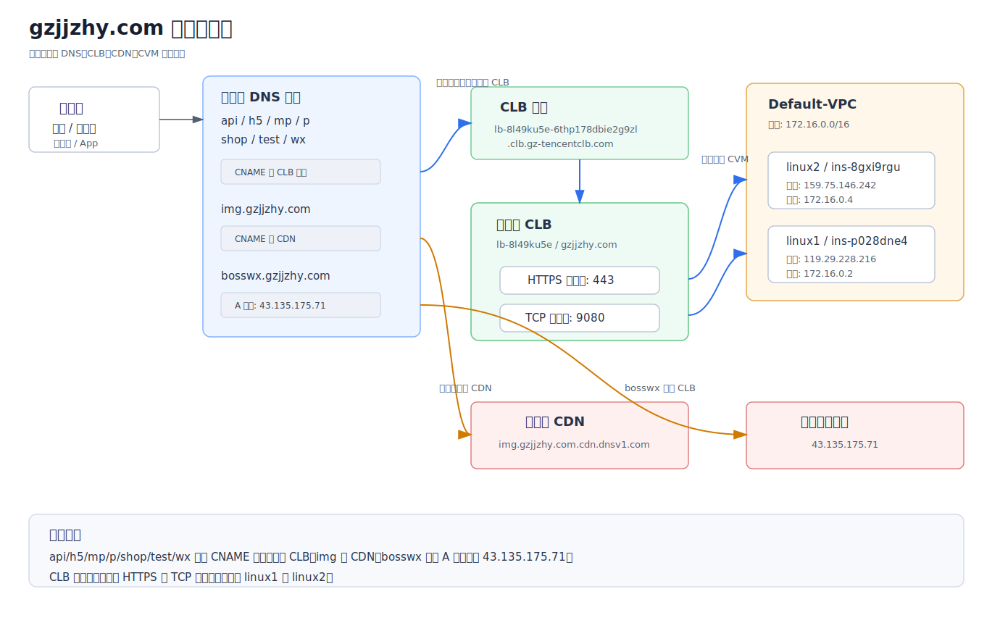
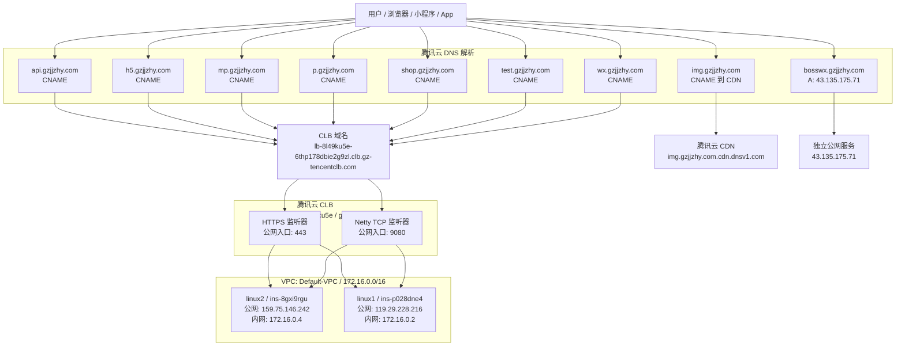
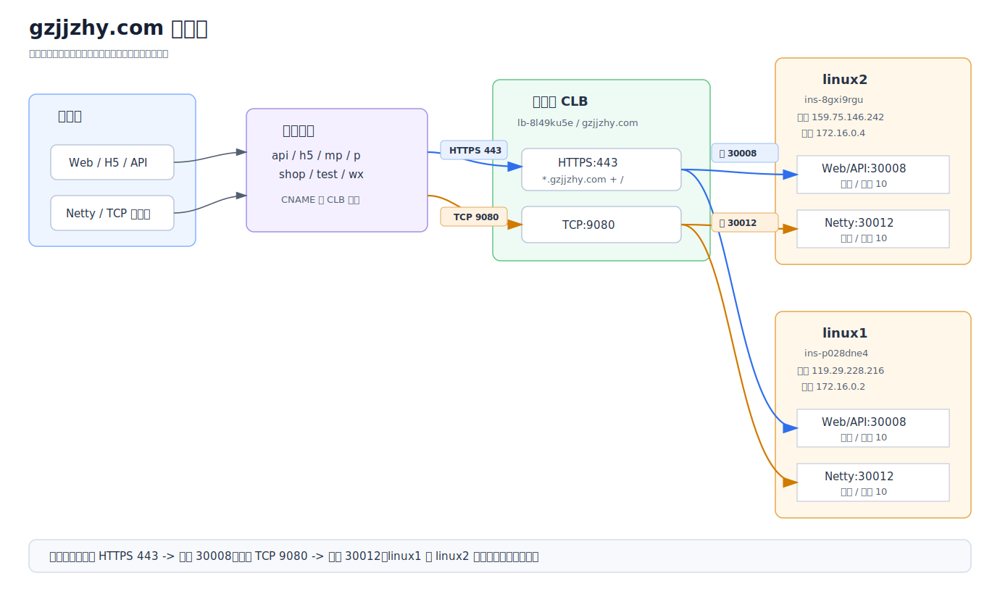
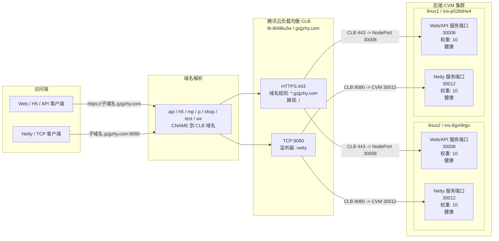
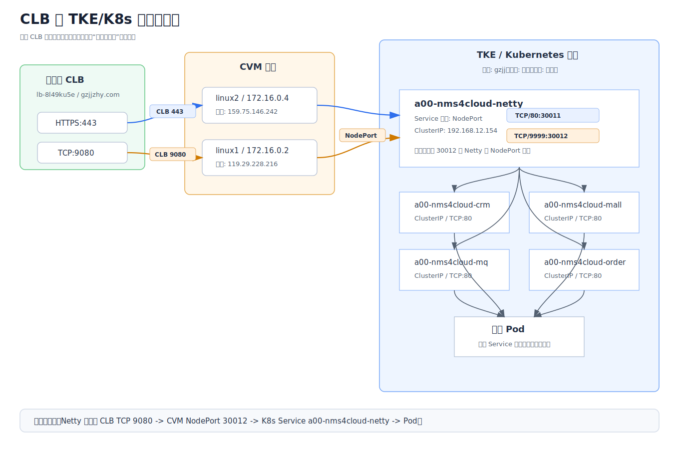
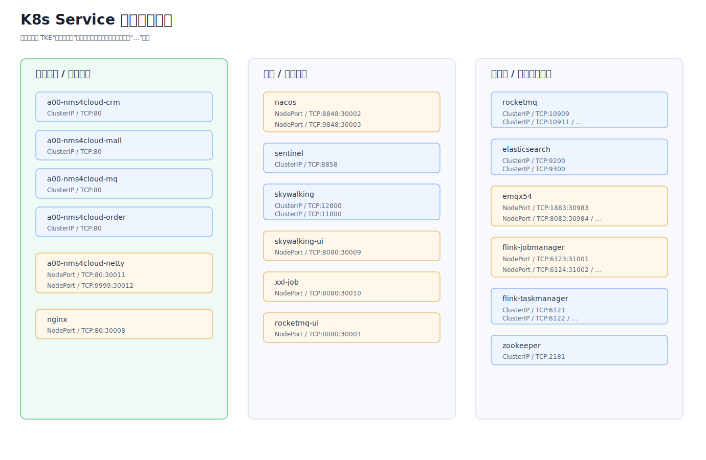

# CLB 网络拓扑与部署图说明

本文档基于腾讯云控制台截图整理，用于说明 `gzjjzhy.com` 相关域名、腾讯云 CLB、后端 CVM、HTTPS 服务、Netty/TCP 服务之间的网络关系和部署关系。

> 说明：本文只整理截图中已经看到的信息。未在截图中展开的证书、安全组、Nginx、应用进程、数据库等配置，需要以服务器和腾讯云控制台实际配置为准。

## 一、当前配置摘要

| 项目 | 当前配置 |
| --- | --- |
| CLB 实例 | `lb-8l49ku5e`，名称 `gzjjzhy.com` |
| CLB 域名 | `lb-8l49ku5e-6thp178dbie2g9zl.clb.gz-tencentclb.com` |
| 网络类型 | 公网 CLB |
| 所属网络 | `Default-VPC`，网段截图显示为 `172.16.0.0/16` |
| HTTPS 入口 | 外部访问 `443`，转发到 CVM 节点 `30008` |
| TCP/Netty 入口 | 外部访问 `9080`，转发到 CVM 节点 `30012` |
| K8s 集群 | 腾讯云 TKE/Kubernetes 集群 `gzjj`，地域广州，状态运行中 |
| Nginx K8s Service | `nginx`，类型 `NodePort`，ClusterIP `192.168.122.237`，端口 `TCP/80:30008` |
| Netty K8s Service | `a00-nms4cloud-netty`，类型 `NodePort`，ClusterIP `192.168.12.154` |
| Netty NodePort | `TCP/80:30011`、`TCP/9999:30012` |
| 后端服务器 1 | `linux1 / ins-p028dne4`，公网 `119.29.228.216`，内网 `172.16.0.2` |
| 后端服务器 2 | `linux2 / ins-8gxi9rgu`，公网 `159.75.146.242`，内网 `172.16.0.4` |
| 后端权重 | 两台服务器权重均为 `10` |
| 健康状态 | 两台服务器在 HTTPS 和 TCP 监听器下均显示健康 |

## 二、网络拓扑图



> 如果 Markdown 预览插件不支持 Mermaid，请以上面的 SVG 图片为准。下面保留 Mermaid 源码，便于后续维护。



## 三、部署图



> 如果 Markdown 预览插件不支持 Mermaid，请以上面的 SVG 图片为准。下面保留 Mermaid 源码，便于后续维护。



## 四、K8s 服务部署补充图



这张图补充说明 CLB 后端端口进入 CVM 后，如何继续进入 Kubernetes Service。当前截图能确认 Netty 服务是 NodePort 暴露方式：

```text
CLB TCP:9080
  -> CVM 节点 NodePort:30012
  -> K8s Service: a00-nms4cloud-netty
  -> Service 端口: TCP/9999
  -> 后端 Pod
```

截图中还可以看到多个业务服务是 `ClusterIP` 类型，例如：

```text
a00-nms4cloud-crm    ClusterIP / TCP:80
a00-nms4cloud-mall   ClusterIP / TCP:80
a00-nms4cloud-mq     ClusterIP / TCP:80
a00-nms4cloud-order  ClusterIP / TCP:80
```

`ClusterIP` 类型服务只能在 Kubernetes 集群内部访问，不能直接被公网访问。它们通常需要通过 Ingress、网关、NodePort 或其他入口服务转发。

## 五、K8s Service 清单



| 服务名 | 类型 | 服务 IP | 端口 | 说明 |
| --- | --- | --- | --- | --- |
| `nginx` | NodePort | `192.168.122.237` | `TCP/80:30008` | Web/API/H5 入口，CLB HTTPS 443 的后端端口 |
| `a00-nms4cloud-netty` | NodePort | `192.168.12.154` | `TCP/80:30011`、`TCP/9999:30012` | Netty 服务，CLB TCP 9080 的后端端口 |
| `a00-nms4cloud-crm` | ClusterIP | `192.168.81.208` | `TCP/80` | CRM 业务服务，集群内部访问 |
| `a00-nms4cloud-mall` | ClusterIP | `192.168.92.246` | `TCP/80` | Mall 业务服务，集群内部访问 |
| `a00-nms4cloud-mq` | ClusterIP | `192.168.65.98` | `TCP/80` | MQ 相关业务服务，集群内部访问 |
| `a00-nms4cloud-order` | ClusterIP | `192.168.96.206` | `TCP/80` | Order 业务服务，集群内部访问 |
| `nacos` | NodePort | `192.168.97.18` | `TCP/8848:30002`、`TCP/9848:30003` | 注册中心 / 配置中心 |
| `rocketmq` | ClusterIP | `192.168.119.148` | `TCP/10909`、`TCP/10911`、`...` | 消息队列服务 |
| `rocketmq-ui` | NodePort | `192.168.72.34` | `TCP/8080:30001` | RocketMQ 控制台 |
| `sentinel` | ClusterIP | `192.168.24.73` | `TCP/8858` | 流量治理 / 熔断限流 |
| `skywalking` | ClusterIP | `192.168.76.250` | `TCP/12800`、`TCP/11800` | 链路追踪后端 |
| `skywalking-ui` | NodePort | `192.168.40.28` | `TCP/8080:30009` | 链路追踪页面 |
| `xxl-job` | NodePort | `192.168.89.50` | `TCP/8080:30010` | 分布式任务调度 |
| `elasticsearch` | ClusterIP | `192.168.41.234` | `TCP/9200`、`TCP/9300` | 搜索和日志存储 |
| `emqx54` | NodePort | `192.168.83.163` | `TCP/1883:30983`、`TCP/8083:30984`、`...` | MQTT 服务 |
| `flink-jobmanager` | NodePort | `192.168.83.159` | `TCP/6123:31001`、`TCP/6124:31002`、`...` | Flink 作业管理 |
| `flink-taskmanager` | ClusterIP | `192.168.25.92` | `TCP/6121`、`TCP/6122`、`...` | Flink 任务执行 |
| `zookeeper` | ClusterIP | `192.168.120.236` | `TCP/2181` | 分布式协调服务 |

> 表格中带 `...` 的端口表示截图里还有更多端口，但被控制台折叠或截断，最终以腾讯云控制台或 `kubectl get svc` 输出为准。

## 六、访问链路说明

### 1. Web / API / H5 访问链路

用户访问：

```text
https://api.gzjjzhy.com
https://h5.gzjjzhy.com
https://shop.gzjjzhy.com
```

实际链路：

```text
用户浏览器
  -> DNS CNAME 解析到 CLB 域名
  -> 腾讯云 CLB HTTPS:443
  -> 命中 *.gzjjzhy.com 域名规则
  -> 命中 / 路径规则
  -> 转发到 linux1:30008 或 linux2:30008
  -> 进入 K8s nginx Service
  -> Nginx 转发到集群内业务服务
```

结论：公网用户访问的是标准 HTTPS 端口 `443`，CLB 后端端口是 K8s `nginx` 的 NodePort `30008`。

### 2. Netty / TCP 访问链路

客户端访问：

```text
api.gzjjzhy.com:9080
```

实际链路：

```text
客户端
  -> DNS CNAME 解析到 CLB 域名
  -> 腾讯云 CLB TCP:9080
  -> 转发到 linux1:30012 或 linux2:30012
  -> 进入 K8s a00-nms4cloud-netty Service
  -> 转发到后端 Netty Pod
```

结论：公网暴露的是 `9080` 端口，CLB 后端端口是 K8s `a00-nms4cloud-netty` 的 NodePort `30012`。

### 3. 图片资源访问链路

`img.gzjjzhy.com` 的 DNS 记录指向：

```text
img.gzjjzhy.com.cdn.dnsv1.com
```

结论：图片域名走 CDN，不走当前 CLB。

### 4. bosswx 访问链路

`bosswx.gzjjzhy.com` 是 A 记录，指向：

```text
43.135.175.71
```

结论：`bosswx` 没有走当前 CLB，而是直连公网服务器 `43.135.175.71`。

## 七、Nginx 静态页面部署说明

你提供的 Nginx Deployment YAML 里，Nginx 容器使用的是官方镜像：

```yaml
image: nginx:1.27.5
```

`nginx -T` 的完整整理和逐段讲解已单独整理到：

```text
Nginx配置文件整理与讲解.md
```

这说明镜像本身大概率只是标准 Nginx 运行环境，不是每次把前端静态页面重新打进镜像。真正决定“页面在哪里、域名转到哪里”的关键是下面这些挂载：

```yaml
volumeMounts:
  - mountPath: /etc/nginx/conf.d/
    name: nginx
  - mountPath: /rocketmq
    name: rocketmq
  - mountPath: /elasticsearch
    name: elasticsearch
  - mountPath: /zookeeper
    name: zookeeper
  - mountPath: /kafka
    name: kafka
```

对应的底层存储是多台 NFS：

```yaml
volumes:
  - name: nginx
    nfs:
      server: 172.16.0.22
      path: /
  - name: rocketmq
    nfs:
      server: 172.16.0.19
      path: /
  - name: elasticsearch
    nfs:
      server: 172.16.0.114
      path: /
  - name: zookeeper
    nfs:
      server: 172.16.0.131
      path: /
  - name: kafka
    nfs:
      server: 172.16.0.16
      path: /
```

因此当前 Nginx 的部署方式可以理解为：

```text
Nginx Pod
  -> 使用 nginx:1.27.5 官方镜像启动
  -> 从 NFS 172.16.0.22 挂载 Nginx 配置到 /etc/nginx/conf.d/
  -> 从其他 NFS 挂载静态文件目录到 /rocketmq、/elasticsearch、/zookeeper、/kafka
  -> 根据 /etc/nginx/conf.d/ 里的 server/location 配置决定访问哪个静态目录或后端服务
```

### 1. 静态页面大概率部署在哪里

从 YAML 看，静态页面不太可能在容器镜像内。结合 `nginx -T` 输出后，可以进一步确认：主前端页面主要不是由 Nginx 本地目录提供，而是由 Nginx 反向代理到腾讯云 COS 静态网站。

实际配置里有：

```nginx
location / {
    root   /usr/share/nginx/html;
    proxy_pass  https://shop-lmnsaas-com-1251303505.cos-website.ap-guangzhou.myqcloud.com;
}
```

以及：

```nginx
location / {
    root   /usr/share/nginx/html;
    proxy_pass  https://p-lmnsaas-com-1251303505.cos-website.ap-guangzhou.myqcloud.com;
}
```

这里虽然写了：

```nginx
root /usr/share/nginx/html;
```

但同一个 `location /` 里又写了：

```nginx
proxy_pass https://...cos-website.ap-guangzhou.myqcloud.com;
```

对普通页面请求来说，`proxy_pass` 会把请求转发到 COS 静态网站。也就是说，主要页面资源来自腾讯云 COS，而不是来自容器内 `/usr/share/nginx/html`。

最需要检查的是：

```text
/etc/nginx/conf.d/
/rocketmq
/elasticsearch
/zookeeper
/kafka
```

其中 `/etc/nginx/conf.d/` 是 Nginx 配置目录，里面的 `.conf` 文件会写明：

```text
server_name 对应哪个域名
root 或 alias 指向哪个静态页面目录
proxy_pass 转发到哪个后端 Service
```

如果配置里写了 `root /rocketmq;`，那么 RocketMQ UI 静态文件就在 `/rocketmq` 挂载目录下。如果写了 `alias /elasticsearch/xxx;`，那么对应页面就在 `/elasticsearch/xxx` 下。

从当前 `nginx -T` 看，`/etc/nginx/conf.d/` 中还放了少量本地静态资源：

```nginx
location /logo.png {
    alias /etc/nginx/conf.d/logo.png;
}

location /logo.svg {
    alias /etc/nginx/conf.d/logo.svg;
}

location /favicon.ico {
    alias /etc/nginx/conf.d/favicon.ico;
}
```

这些 `logo.png`、`logo.svg`、`favicon.ico` 来自 CFS/NFS 挂载的 `/etc/nginx/conf.d/`，不是镜像内文件。

### 2. 多个前端项目如何部署到同一个 Nginx

多个前端项目通常有两种部署方式。

第一种是按域名区分：

```nginx
server {
    listen 80;
    server_name h5.gzjjzhy.com;
    root /nginx/html/h5;
    index index.html;
}

server {
    listen 80;
    server_name shop.gzjjzhy.com;
    root /nginx/html/shop;
    index index.html;
}
```

这种方式下，`h5.gzjjzhy.com` 和 `shop.gzjjzhy.com` 访问的是不同目录。

第二种是按路径区分：

```nginx
server {
    listen 80;
    server_name h5.gzjjzhy.com;

    location /admin/ {
        alias /nginx/html/admin/;
        try_files $uri $uri/ /admin/index.html;
    }

    location /shop/ {
        alias /nginx/html/shop/;
        try_files $uri $uri/ /shop/index.html;
    }
}
```

这种方式下，同一个域名下面用不同路径访问不同前端项目。

### 3. Nginx 配置示例逐行讲解

下面这段配置的含义是：同一个域名 `h5.gzjjzhy.com` 下，通过不同路径访问不同前端项目。

```nginx
server {
    listen 80;
    server_name h5.gzjjzhy.com;

    location /admin/ {
        alias /nginx/html/admin/;
        try_files $uri $uri/ /admin/index.html;
    }

    location /shop/ {
        alias /nginx/html/shop/;
        try_files $uri $uri/ /shop/index.html;
    }
}
```

整体访问效果可以理解为：

```text
https://h5.gzjjzhy.com/admin/
  -> CLB HTTPS:443
  -> K8s nginx NodePort 30008
  -> Nginx server_name h5.gzjjzhy.com
  -> location /admin/
  -> 读取 /nginx/html/admin/ 目录下的前端文件

https://h5.gzjjzhy.com/shop/
  -> CLB HTTPS:443
  -> K8s nginx NodePort 30008
  -> Nginx server_name h5.gzjjzhy.com
  -> location /shop/
  -> 读取 /nginx/html/shop/ 目录下的前端文件
```

#### `server { ... }`

`server` 是一个虚拟站点配置块。一个 Nginx 可以配置多个 `server`，每个 `server` 可以对应一个域名、一个端口或一组访问规则。

可以把它理解为：

```text
一个 server = 一个站点入口规则
```

例如：

```nginx
server {
    listen 80;
    server_name h5.gzjjzhy.com;
}
```

表示 Nginx 内部有一个站点，专门处理 `h5.gzjjzhy.com` 这个域名的 HTTP 请求。

#### `listen 80;`

`listen` 表示 Nginx 在容器内部监听哪个端口。

当前 K8s Service 是：

```text
nginx Service: TCP/80:30008
```

含义是：

```text
CLB 443
  -> CVM NodePort 30008
  -> K8s Service 80
  -> Nginx 容器 listen 80
```

所以这里写 `listen 80;` 是合理的。公网用户访问的是 `443`，但进入 Nginx 容器后已经变成内部的 `80` 端口。

#### `server_name h5.gzjjzhy.com;`

`server_name` 用来匹配请求头里的域名，也就是 HTTP Header 里的 `Host`。

用户访问：

```text
https://h5.gzjjzhy.com/admin/
```

浏览器会带上：

```text
Host: h5.gzjjzhy.com
```

Nginx 收到请求后，会根据 `server_name h5.gzjjzhy.com;` 找到这个 `server` 配置块。

如果还有另一个配置：

```nginx
server {
    listen 80;
    server_name shop.gzjjzhy.com;
}
```

那么 `shop.gzjjzhy.com` 的请求会进入另一个 `server`，不会进入 `h5.gzjjzhy.com` 这个配置块。

#### `location /admin/ { ... }`

`location` 用来匹配 URL 路径。

例如用户访问：

```text
https://h5.gzjjzhy.com/admin/user/list
```

Nginx 看到路径是：

```text
/admin/user/list
```

它会匹配：

```nginx
location /admin/ {
}
```

也就是说，所有以 `/admin/` 开头的请求都会进入这个 `location`。

#### `alias /nginx/html/admin/;`

`alias` 表示把某个 URL 路径映射到服务器上的某个真实目录。

这里：

```nginx
location /admin/ {
    alias /nginx/html/admin/;
}
```

含义是：

```text
URL 路径 /admin/
  -> 映射到文件目录 /nginx/html/admin/
```

举例：

```text
访问 URL:
/admin/js/app.js

Nginx 实际读取:
/nginx/html/admin/js/app.js
```

再举例：

```text
访问 URL:
/admin/css/index.css

Nginx 实际读取:
/nginx/html/admin/css/index.css
```

注意：`location /admin/` 和 `alias /nginx/html/admin/` 通常都建议以 `/` 结尾，避免路径拼接错误。

#### `try_files $uri $uri/ /admin/index.html;`

`try_files` 的意思是按顺序尝试找文件。

这行：

```nginx
try_files $uri $uri/ /admin/index.html;
```

可以拆成三步：

```text
1. 先找当前请求对应的文件：$uri
2. 如果不是文件，再尝试当前请求对应的目录：$uri/
3. 如果都找不到，就返回 /admin/index.html
```

为什么最后要返回 `/admin/index.html`？

因为 Vue、React、Taro H5 等前端项目经常是单页应用。前端路由可能是：

```text
/admin/user/list
/admin/order/detail
/admin/settings
```

这些路径在服务器上不一定真实存在对应文件。如果没有 `try_files` 回退到 `index.html`，刷新页面时 Nginx 会去找：

```text
/nginx/html/admin/user/list
```

这个文件不存在，就会返回 404。

加上：

```nginx
try_files $uri $uri/ /admin/index.html;
```

以后，Nginx 找不到真实文件时，会返回前端项目入口：

```text
/admin/index.html
```

然后由前端路由接管页面显示。

在当前真实配置中，`nginx -T` 输出里可以看到：

```nginx
try_files $uri /index.html;
```

同时 `location /` 中还有：

```nginx
proxy_pass https://shop-lmnsaas-com-1251303505.cos-website.ap-guangzhou.myqcloud.com;
```

这种情况下，普通首页和前端资源请求主要由 `proxy_pass` 转发到腾讯云 COS 静态网站处理。`try_files` 更像是历史遗留或兜底配置，不能据此判断静态页面就在容器本地。

#### `/shop/` 配置同理

```nginx
location /shop/ {
    alias /nginx/html/shop/;
    try_files $uri $uri/ /shop/index.html;
}
```

访问关系是：

```text
/shop/
  -> /nginx/html/shop/

/shop/js/app.js
  -> /nginx/html/shop/js/app.js

/shop/order/list
  -> 找不到真实文件时回退到 /shop/index.html
```

### 4. `root` 和 `alias` 的区别

Nginx 中 `root` 和 `alias` 都能指定静态文件目录，但路径拼接方式不同。

使用 `root`：

```nginx
location /admin/ {
    root /nginx/html;
}
```

访问：

```text
/admin/js/app.js
```

实际读取：

```text
/nginx/html/admin/js/app.js
```

使用 `alias`：

```nginx
location /admin/ {
    alias /nginx/html/admin/;
}
```

访问：

```text
/admin/js/app.js
```

实际读取：

```text
/nginx/html/admin/js/app.js
```

这两个例子结果刚好一样，但拼接逻辑不一样：

```text
root  = root目录 + 完整URL路径
alias = alias目录 + 去掉location前缀后的剩余路径
```

更直观地看：

| 配置 | URL | 实际文件 |
| --- | --- | --- |
| `root /nginx/html;` | `/admin/js/app.js` | `/nginx/html/admin/js/app.js` |
| `alias /nginx/html/admin/;` | `/admin/js/app.js` | `/nginx/html/admin/js/app.js` |

如果使用 `alias`，要特别注意目录结尾的 `/`。常见写法是：

```nginx
location /admin/ {
    alias /nginx/html/admin/;
}
```

### 5. 多前端项目部署时的目录结构示例

如果多个前端项目都放在 Nginx 里，目录可能类似：

```text
/nginx/html/
  admin/
    index.html
    js/
    css/
    assets/
  shop/
    index.html
    js/
    css/
    assets/
  h5/
    index.html
    js/
    css/
    assets/
```

对应访问关系：

| 访问地址 | Nginx 匹配 | 静态目录 |
| --- | --- | --- |
| `https://h5.gzjjzhy.com/admin/` | `location /admin/` | `/nginx/html/admin/` |
| `https://h5.gzjjzhy.com/shop/` | `location /shop/` | `/nginx/html/shop/` |
| `https://h5.gzjjzhy.com/h5/` | `location /h5/` | `/nginx/html/h5/` |

### 6. 在当前环境中如何确认真实配置

你给的 Deployment YAML 里没有直接看到 `/nginx/html` 这个挂载点，所以示例中的 `/nginx/html/admin/` 只是讲解用路径，不代表当前生产环境一定是这个目录。

当前环境真正的目录，需要看 Nginx 实际加载的配置：

```powershell
kubectl -n default exec deploy/nginx -- nginx -T | Select-String "server_name|location|root|alias|try_files|proxy_pass"
```

重点看这些字段：

```text
server_name  决定域名
location     决定路径
root/alias   决定静态文件目录
try_files    决定前端路由刷新是否回退 index.html
proxy_pass   决定是否转发到后端 API 服务
```

### 7. 当前链路里的 Nginx 位置

结合 CLB 和 K8s Service 截图，当前 Web/H5/API 入口链路应理解为：

```text
用户访问 https://h5.gzjjzhy.com
  -> DNS CNAME 到 CLB
  -> CLB HTTPS:443
  -> CLB 后端端口 30008
  -> CVM 节点 NodePort 30008
  -> K8s Service nginx:80
  -> Nginx Pod
  -> 根据 /etc/nginx/conf.d/ 配置代理到 COS 静态网站或转发 API
```

这里的 `30008` 不是普通 Linux 进程直接监听的端口，而是 Kubernetes `nginx` Service 暴露出来的 NodePort。

根据你提供的 `nginx -T`，主要域名规则如下：

| 配置文件 | server_name | 首页/静态页面来源 | API 来源 |
| --- | --- | --- | --- |
| `gzjj_lmnsaas_com.conf` | `gzjj.lmnsaas.com`、`shop.gzjjzhy.com`、`wx.gzjjzhy.com`、`h5.gzjjzhy.com`、`api.gzjjzhy.com`、`mp.gzjjzhy.com` | `shop-lmnsaas-com-1251303505.cos-website.ap-guangzhou.myqcloud.com` | `gateway/api/` |
| `p_lmnsaas_com.conf` | `paygzjj.lmnsaas.com`、`p.gzjjzhy.com` | `p-lmnsaas-com-1251303505.cos-website.ap-guangzhou.myqcloud.com` | `gateway/api/` |

因此当前 Web 访问链路更准确地说是：

```text
用户访问 https://h5.gzjjzhy.com
  -> DNS CNAME 到 CLB
  -> CLB HTTPS:443
  -> CVM NodePort 30008
  -> K8s Service nginx:80
  -> Nginx Pod
  -> proxy_pass 到腾讯云 COS 静态网站
```

API 访问链路是：

```text
用户访问 https://api.gzjjzhy.com/api/xxx
  -> DNS CNAME 到 CLB
  -> CLB HTTPS:443
  -> CVM NodePort 30008
  -> K8s Service nginx:80
  -> Nginx Pod
  -> proxy_pass 到 http://gateway/api/
```

MQTT/WebSocket 访问链路是：

```text
用户访问 /mqtt
  -> Nginx Pod
  -> upstream api_bakend_wss
  -> emqx54:8083
```

其中：

```nginx
upstream api_bakend_wss {
    ip_hash;
    server emqx54:8083 max_fails=0 weight=1;
}
```

说明 `/mqtt` 最终转发到 K8s 内部服务 `emqx54:8083`。

### 8. 如何确认实际页面目录

需要进入 Nginx Pod 查看运行时配置：

```bash
kubectl -n default exec deploy/nginx -- nginx -T
kubectl -n default exec deploy/nginx -- ls -la /etc/nginx/conf.d/
kubectl -n default exec deploy/nginx -- ls -la /rocketmq /elasticsearch /zookeeper /kafka
```

如果要快速找静态页面目录，可以重点搜索：

```bash
kubectl -n default exec deploy/nginx -- nginx -T | grep -E "server_name|root|alias|proxy_pass"
```

在 Windows PowerShell 中可以用：

```powershell
kubectl -n default exec deploy/nginx -- nginx -T | Select-String "server_name|root|alias|proxy_pass"
```

最终以 `nginx -T` 输出为准。它会打印 Nginx 实际加载的完整配置，比只看 Deployment YAML 更准确。

### 9. Nginx Deployment 的存储介质分析

你提供的 Nginx Deployment YAML 中没有使用 Kubernetes `ConfigMap`、`Secret`、`PersistentVolumeClaim`，而是直接使用了 `nfs` 类型的 Volume。

结合腾讯云“文件存储”控制台截图可以进一步确认：这些 `172.16.0.x` 地址实际对应腾讯云 CFS 文件系统。也就是说，K8s YAML 中写的是 `nfs` 协议挂载，底层云产品是腾讯云 CFS。

可以理解为：

```text
Kubernetes 视角：nfs volume
腾讯云产品视角：CFS 文件存储
容器视角：普通 Linux 目录
```

关键配置如下：

```yaml
volumes:
  - name: rocketmq
    nfs:
      path: /
      server: 172.16.0.19
  - name: nginx
    nfs:
      path: /
      server: 172.16.0.22
  - name: elasticsearch
    nfs:
      path: /
      server: 172.16.0.114
  - name: zookeeper
    nfs:
      path: /
      server: 172.16.0.131
  - name: kafka
    nfs:
      path: /
      server: 172.16.0.16
```

挂载到容器内的位置是：

```yaml
volumeMounts:
  - mountPath: /rocketmq
    name: rocketmq
  - mountPath: /etc/nginx/conf.d/
    name: nginx
  - mountPath: /elasticsearch
    name: elasticsearch
  - mountPath: /zookeeper
    name: zookeeper
  - mountPath: /kafka
    name: kafka
```

这表示 Nginx Pod 中的这些目录不是容器本地目录，而是来自远端 CFS 文件系统，并通过 NFS 协议挂载进容器。

| Volume 名称 | CFS/NFS IP | NFS 路径 | 容器内挂载点 | 可能用途 |
| --- | --- | --- | --- | --- |
| `nginx` | `172.16.0.22` | `/` | `/etc/nginx/conf.d/` | Nginx 站点配置文件 |
| `rocketmq` | `172.16.0.19` | `/` | `/rocketmq` | RocketMQ 控制台静态文件或相关资源 |
| `elasticsearch` | `172.16.0.114` | `/` | `/elasticsearch` | Elasticsearch/Kibana 类静态入口或相关资源 |
| `zookeeper` | `172.16.0.131` | `/` | `/zookeeper` | Zookeeper 相关静态入口或资源 |
| `kafka` | `172.16.0.16` | `/` | `/kafka` | Kafka 相关静态入口或资源 |

从 CFS 控制台截图可以看到这些文件系统信息：

| CFS 名称 | CFS IP | 容量/使用量 | 吞吐上限 | 对应 Nginx 挂载 |
| --- | --- | --- | --- | --- |
| `nginx` | `172.16.0.22` | `1MiB/32TiB` | `200MiB/s` | `/etc/nginx/conf.d/` |
| `rocketmq` | `172.16.0.19` | `4.16GiB/32TiB` | `200MiB/s` | `/rocketmq` |
| `elasticsearch` | `172.16.0.114` | `134MiB/32TiB` | `200MiB/s` | `/elasticsearch` |
| `kafka` | `172.16.0.16` | `2.08GiB/32TiB` | `200MiB/s` | `/kafka` |
| `zookeeper` | `172.16.0.131` | 截图中仅部分可见 | `200MiB/s` | `/zookeeper` |

其中 `nginx` 这个 CFS 的详情页显示：

```text
CFS ID: cfs-gd7d0sk9
名称: nginx
网络: Default-VPC / Default-Subnet
挂载点 IP: 172.16.0.22
权限组: 默认权限组
```

控制台给出的 Linux 挂载示例包括：

```bash
sudo mount -t nfs -o vers=3,nolock,proto=tcp,noresvport 172.16.0.22:/mwvqrmme/ /localfolder
sudo mount -t nfs -o vers=4.0,noresvport 172.16.0.22:/ /localfolder
```

控制台给出的 Windows 挂载示例是：

```powershell
mount -o nolock mtype=hard 172.16.0.22:/mwvqrmme x:
```

这里要注意两个路径概念：

```text
172.16.0.22:/mwvqrmme/  是 CFS 控制台推荐的 NFSv3 根目录挂载路径
172.16.0.22:/           是 NFSv4 示例中的根目录挂载路径
```

而 Kubernetes YAML 里写的是：

```yaml
nfs:
  server: 172.16.0.22
  path: /
```

因此实际 Pod 内看到的内容，要以容器运行时挂载结果为准。最准确的确认方式是进入 Nginx Pod 查看：

```powershell
kubectl -n default exec deploy/nginx -- mount | Select-String "172.16.0.22|/etc/nginx/conf.d"
kubectl -n default exec deploy/nginx -- ls -la /etc/nginx/conf.d/
```

如果需要从一台 CVM 手工挂载同一个 CFS 来查看文件，优先使用控制台推荐的 NFSv3 命令：

```bash
sudo mkdir -p /mnt/cfs-nginx
sudo mount -t nfs -o vers=3,nolock,proto=tcp,noresvport 172.16.0.22:/mwvqrmme/ /mnt/cfs-nginx
ls -la /mnt/cfs-nginx
```

如果使用 NFSv4：

```bash
sudo mkdir -p /mnt/cfs-nginx
sudo mount -t nfs -o vers=4.0,noresvport 172.16.0.22:/ /mnt/cfs-nginx
ls -la /mnt/cfs-nginx
```

从这个设计可以判断：

```text
Nginx 镜像只提供运行环境
Nginx 配置来自 CFS/NFS 172.16.0.22
部分静态文件或运维页面资源来自其他 CFS/NFS 文件系统
```

#### 为什么说它是 NFS 存储

Kubernetes 中 Volume 有很多类型，例如：

```text
emptyDir
hostPath
configMap
secret
persistentVolumeClaim
nfs
```

你的 YAML 明确写的是：

```yaml
nfs:
  server: 172.16.0.22
  path: /
```

所以这里的存储介质从协议上看是 NFS，也就是网络文件系统；从腾讯云资源上看是 CFS。Pod 启动时，K8s 会把远端 CFS/NFS 目录挂载到容器指定路径。

#### CFS 和 NFS 的关系

CFS 是腾讯云的文件存储产品，NFS 是 Linux 常用的网络文件系统协议。

两者关系可以这样理解：

```text
CFS = 腾讯云提供的托管文件存储服务
NFS = 访问这个文件存储时使用的协议
```

所以控制台里看到的是 CFS 文件系统，Kubernetes YAML 里写的是：

```yaml
nfs:
  server: 172.16.0.22
  path: /
```

这不是矛盾，而是同一件事的两个视角。

#### NFS 挂载的特点

NFS 是远程共享文件系统。它的特点是：

```text
文件实际存放在 CFS 文件系统上
Pod 内看到的是挂载后的远程目录
多个 Pod 可以同时挂载同一个 NFS 目录
Pod 重建后文件仍然存在
更新 CFS 上的文件后，Pod 内通常能看到新文件
```

这和容器本地文件不同。容器本地文件随 Pod 删除而丢失，而 CFS/NFS 文件不会因为 Nginx Pod 重启而消失。

#### 为什么 Nginx 配置要放到 NFS

`/etc/nginx/conf.d/` 是 Nginx 的配置目录。把它挂到 NFS 后，配置文件不在镜像里，而是在 NFS 上。

好处是：

```text
修改 Nginx 站点配置不需要重新构建镜像
多个 Nginx Pod 可以读取同一份配置
迁移或重建 Pod 后配置仍然保留
可以用外部发布脚本直接更新配置文件
```

代价是：

```text
NFS 服务器变成关键依赖
配置文件修改缺少镜像版本记录
如果多人直接改 NFS 文件，容易出现不可追踪变更
配置写错会影响所有挂载该 NFS 的 Nginx Pod
```

#### 为什么多个 NFS 挂到 Nginx

`/rocketmq`、`/elasticsearch`、`/zookeeper`、`/kafka` 这些挂载点看起来像是给不同运维组件或静态入口准备的资源目录。

一种常见模式是：

```text
Nginx 统一作为 Web 入口
不同路径对应不同组件页面
每个组件页面或静态资源放在对应 NFS
Nginx 通过 alias/root 映射到这些目录
```

例如配置可能类似：

```nginx
location /rocketmq/ {
    alias /rocketmq/;
    index index.html;
}

location /elasticsearch/ {
    alias /elasticsearch/;
    index index.html;
}
```

这只是推测示例，真实情况必须看 `nginx -T` 输出。

#### 当前存储设计的风险

这个设计能运行，但需要注意以下风险：

```text
NFS 单点故障：NFS 服务器不可用会导致 Nginx 配置或静态资源不可用
配置漂移：配置文件在 NFS 上直接修改，可能绕过 Git 和发布流程
权限风险：NFS 权限过宽时，误删或误改会直接影响线上
启动风险：Pod 启动时如果 NFS 挂载失败，Nginx Pod 可能无法正常启动
一致性风险：多个前端项目共用一个 Nginx 入口，错误配置可能互相影响
可观测性不足：只看 Deployment YAML 看不出具体 server_name、root、alias、proxy_pass
```

#### 当前存储设计的优点

这个设计也有明显优点：

```text
Nginx 镜像简单，使用官方镜像即可
静态文件和配置更新比较快
Pod 重启不会丢失配置和静态资源
多个副本可以共享同一份配置和文件
适合早期快速部署或内网运维页面统一入口
```

#### 建议的确认命令

确认挂载是否成功：

```powershell
kubectl -n default exec deploy/nginx -- mount
```

查看挂载目录：

```powershell
kubectl -n default exec deploy/nginx -- ls -la /etc/nginx/conf.d/
kubectl -n default exec deploy/nginx -- ls -la /rocketmq
kubectl -n default exec deploy/nginx -- ls -la /elasticsearch
kubectl -n default exec deploy/nginx -- ls -la /zookeeper
kubectl -n default exec deploy/nginx -- ls -la /kafka
```

查看 Nginx 实际配置：

```powershell
kubectl -n default exec deploy/nginx -- nginx -T
```

快速提取关键配置：

```powershell
kubectl -n default exec deploy/nginx -- nginx -T | Select-String "server_name|location|root|alias|try_files|proxy_pass"
```

确认 Pod 是否因为 NFS 有异常事件：

```powershell
kubectl -n default describe pod -l k8s-app=nginx
```

重点查看：

```text
MountVolume
Unable to mount volumes
permission denied
connection timed out
stale file handle
```

#### 当前 nginx -T 输出中的警告

你执行 `nginx -T` 时出现了这个警告：

```text
could not build optimal proxy_headers_hash,
you should increase either proxy_headers_hash_max_size: 512
or proxy_headers_hash_bucket_size: 64
```

这个警告不是配置语法错误。`nginx -T` 后面已经显示：

```text
nginx: the configuration file /etc/nginx/nginx.conf syntax is ok
nginx: configuration file /etc/nginx/nginx.conf test is successful
```

含义是：当前 `proxy_set_header` 等代理请求头配置较多，Nginx 认为默认 hash 表大小不够理想，但仍然可以加载配置。

如果要消除警告，可以在 `http {}` 中增加类似配置：

```nginx
proxy_headers_hash_max_size 1024;
proxy_headers_hash_bucket_size 128;
```

不过当前 `http {}` 在镜像内的 `/etc/nginx/nginx.conf`，而业务只挂载了 `/etc/nginx/conf.d/`。是否修改需要看你们是否允许定制 Nginx 主配置或自定义镜像。它不是当前访问链路的核心问题。

#### 更规范的改造方向

如果后续要提高可维护性，可以考虑：

```text
Nginx 配置用 ConfigMap 管理
静态前端产物打入独立镜像，按项目独立发布
或者使用 PVC/NFS，但发布动作必须经过 Jenkins/Git 记录
每个前端项目独立目录，禁止多个项目混放
关键 NFS 做备份和权限控制
上线前执行 nginx -t 校验配置
```

是否改造取决于团队发布方式。如果当前目标是快速制作安装程序，至少要把 NFS 服务器地址、挂载目录、配置文件路径、静态资源目录写进安装和交付文档。

## 八、术语详细说明

### 1. DNS

DNS 是域名解析系统，用来把用户输入的域名转换成可以访问的网络地址。比如用户访问 `api.gzjjzhy.com`，浏览器会先查询 DNS，知道这个域名应该去访问哪个地址。

在当前配置中，DNS 的作用是把多个业务子域名统一指向腾讯云 CLB 域名。

### 2. 主机记录

主机记录是域名前缀。例如在 `api.gzjjzhy.com` 中：

```text
api = 主机记录
gzjjzhy.com = 主域名
```

截图中看到的 `api`、`h5`、`mp`、`shop`、`test`、`wx` 都是主机记录。

### 3. A 记录

A 记录是把域名直接解析到一个 IPv4 地址。

例如：

```text
bosswx.gzjjzhy.com -> 43.135.175.71
```

这表示访问 `bosswx.gzjjzhy.com` 时，会直接访问 `43.135.175.71`，不会经过当前 CLB。

### 4. CNAME 记录

CNAME 是别名记录，用来把一个域名指向另一个域名。

例如：

```text
api.gzjjzhy.com -> lb-8l49ku5e-6thp178dbie2g9zl.clb.gz-tencentclb.com
```

这表示 `api.gzjjzhy.com` 不直接绑定 IP，而是交给腾讯云 CLB 域名继续解析。CLB 后续 IP 变化时，业务域名通常不需要修改。

### 5. TTL

TTL 是 DNS 缓存时间，单位通常是秒。截图中 TTL 为 `600`，表示 DNS 解析结果可能会被客户端或递归 DNS 缓存约 600 秒。

如果修改 DNS 记录，理论上最长可能需要等待缓存过期后才完全生效。

### 6. CLB

CLB 是腾讯云负载均衡。它对外提供统一访问入口，对内把流量分发到多台后端服务器。

当前 CLB 的作用：

```text
统一接收公网请求
  -> 根据监听器和规则判断流量类型
  -> 分发到 linux1 / linux2
```

### 7. CLB 域名

CLB 域名是腾讯云给负载均衡实例分配的访问域名。

当前 CLB 域名是：

```text
lb-8l49ku5e-6thp178dbie2g9zl.clb.gz-tencentclb.com
```

业务域名通过 CNAME 指向这个 CLB 域名。

### 8. VIP

VIP 是 Virtual IP，虚拟 IP。对用户来说，VIP 是访问负载均衡的入口地址。

在 CLB 场景下，用户访问 VIP 或 CLB 域名，流量会先进入负载均衡，再由负载均衡转给后端服务器。

### 9. EIP

EIP 是 Elastic IP，弹性公网 IP。它是可以绑定、解绑、迁移的公网 IP。

相比动态 IP，EIP 更适合作为长期固定公网入口。如果 CLB 显示动态 IP，建议业务域名使用 CNAME 指向 CLB 域名，而不是直接写死某个 IP。

### 10. 监听器

监听器是 CLB 对外开放的入口端口和协议。

当前有两个核心监听器：

```text
HTTPS:443
TCP:9080
```

`HTTPS:443` 用于 Web、H5、API 请求。`TCP:9080` 用于 Netty 或其他 TCP 长连接服务。

### 11. HTTPS

HTTPS 是加密的 HTTP 协议，默认端口是 `443`。浏览器访问 `https://api.gzjjzhy.com` 时，默认就是访问 443 端口。

当前 CLB 的 HTTPS 监听器对外接收 `443`，再转发给后端服务器 `30008`。

HTTPS 也可以使用其他端口。HTTPS 本质上是“HTTP + TLS 加密”跑在 TCP 连接上，并不是只能绑定 `443`。只要服务端或负载均衡监听了对应端口，客户端也显式写了端口，就可以访问：

```text
https://api.gzjjzhy.com:8443
https://api.gzjjzhy.com:9443
```

但是如果不写端口：

```text
https://api.gzjjzhy.com
```

浏览器会默认访问 `443`。因此非标准端口必须写在 URL 中。

生产环境通常使用 `443` 的原因：

```text
浏览器默认使用 443，URL 更简洁
防火墙、公司网络、运营商网络通常默认放行 443
微信小程序、App、支付回调、第三方平台对 443 支持最好
CDN、WAF、CLB、证书相关配置更常规
用户和运维更容易理解
```

在当前环境中：

```text
公网 HTTPS 443
  -> 腾讯云 CLB
  -> CVM NodePort 30008
  -> K8s nginx Service 80
  -> Nginx Pod
```

这里的 `30008` 不是用户直接访问的 HTTPS 端口，而是 Kubernetes NodePort。用户正常访问：

```text
https://api.gzjjzhy.com
https://h5.gzjjzhy.com
```

不需要访问：

```text
https://api.gzjjzhy.com:30008
```

除非专门绕过 CLB 直接访问节点端口，正常生产访问不建议这样做。

### 12. TCP

TCP 是传输层协议，适合长连接、私有协议、Netty 服务等场景。

当前 TCP 监听器对外开放 `9080`，再转发给后端服务器 `30012`。

### 13. Netty

Netty 是 Java 常用的高性能网络通信框架，常用于长连接、即时通信、设备连接、网关通信等场景。

截图中的 `netty(TCP:9080)` 表示 CLB 上有一个 TCP 监听器，名称叫 `netty`，公网入口端口是 `9080`。

### 14. 转发规则

转发规则决定请求进入 CLB 后应该转发到哪里。

HTTPS 七层转发通常会看：

```text
域名
路径
```

当前截图中看到：

```text
域名规则: *.gzjjzhy.com
路径规则: /
```

这表示 `api.gzjjzhy.com`、`h5.gzjjzhy.com`、`shop.gzjjzhy.com` 等子域名的根路径和子路径都会进入同一组后端。

### 15. 通配域名

`*.gzjjzhy.com` 是通配域名，表示匹配 `gzjjzhy.com` 下的一层子域名。

可以匹配：

```text
api.gzjjzhy.com
h5.gzjjzhy.com
shop.gzjjzhy.com
```

不能匹配：

```text
gzjjzhy.com
a.b.gzjjzhy.com
```

如果需要访问裸域名 `gzjjzhy.com`，需要单独配置裸域名的 DNS、证书和 CLB 转发规则。

### 16. 裸域名

裸域名是不带前缀的主域名，比如：

```text
gzjjzhy.com
```

它不同于：

```text
api.gzjjzhy.com
h5.gzjjzhy.com
```

`*.gzjjzhy.com` 通常不覆盖裸域名，所以裸域名访问需要单独处理。

### 17. 后端服务

后端服务是 CLB 转发流量后真正处理请求的服务器和端口。

当前 HTTPS 后端服务：

```text
linux1:30008
linux2:30008
```

当前 TCP/Netty 后端服务：

```text
linux1:30012
linux2:30012
```

### 18. 后端端口

后端端口是服务器内部应用实际监听的端口。

当前不是：

```text
CLB 443 -> CVM 443
CLB 9080 -> CVM 9080
```

而是：

```text
CLB 443 -> CVM 节点 NodePort 30008 -> K8s nginx Service
CLB 9080 -> CVM 节点 NodePort 30012 -> K8s a00-nms4cloud-netty Service
```

这是排查问题时最容易混淆的点。

### 19. 健康检查

健康检查是 CLB 定期探测后端服务器是否可用。

截图中两台服务器都显示健康，说明 CLB 当前能探测到后端端口，至少网络连通性和端口可达性是正常的。

健康并不等于业务一定完全正常。比如应用接口报错、数据库异常、Host 配置错误，健康检查可能仍然显示正常。

### 20. 权重

权重决定 CLB 分配流量的比例。

当前两台服务器权重都是 `10`，理论上流量大致平均分配：

```text
linux1: 10
linux2: 10
```

实际流量分布还会受到长连接、会话保持、健康检查、连接复用等因素影响。

### 21. CVM

CVM 是腾讯云云服务器。当前有两台后端 CVM：

```text
linux1: 172.16.0.2 / 119.29.228.216
linux2: 172.16.0.4 / 159.75.146.242
```

它们共同承接 CLB 转发过来的业务流量。

### 22. 公网 IP

公网 IP 是互联网上可以访问的 IP。

截图中的公网 IP：

```text
119.29.228.216
159.75.146.242
```

公网 IP 可用于外部直接访问服务器，但生产环境通常建议通过 CLB 统一入口访问业务服务。

### 23. 内网 IP

内网 IP 是 VPC 内部使用的 IP，通常不能被公网直接访问。

截图中的内网 IP：

```text
172.16.0.2
172.16.0.4
```

CLB 和 CVM 在同一个 VPC 时，CLB 通常通过内网 IP 转发到后端服务。

### 24. VPC

VPC 是私有网络，用来隔离云上资源。CVM、CLB、数据库等资源通常部署在同一个 VPC 或可互通的网络中。

当前截图显示所属网络为 `Default-VPC`，网段为 `172.16.0.0/16`。

### 25. CDN

CDN 是内容分发网络，适合静态资源加速，比如图片、CSS、JS、下载文件。

当前 `img.gzjjzhy.com` 指向 CDN，不经过当前 CLB。这种设计通常用于提升图片访问速度并降低源站压力。

### 26. 安全组

安全组是云服务器或 CLB 的网络访问控制规则，类似云上的防火墙。

如果 CLB 健康检查异常，常见原因包括：

```text
后端端口没有启动
安全组没有放行 CLB 到后端端口
服务器防火墙没有放行端口
应用只监听 127.0.0.1，没有监听内网地址
```

当前截图显示健康，说明至少 CLB 到 `30008` 和 `30012` 的探测是通的。

### 27. SSL 证书

SSL 证书用于 HTTPS 加密和域名身份校验。

如果 HTTPS 访问提示证书错误，需要检查证书是否覆盖访问域名。例如：

```text
*.gzjjzhy.com
gzjjzhy.com
```

注意：通配证书 `*.gzjjzhy.com` 通常不等于裸域名 `gzjjzhy.com`。

### 28. WebSocket

WebSocket 是一种基于 HTTP/HTTPS 升级的长连接协议，常见地址形式是：

```text
ws://example.com
wss://example.com
```

如果业务是 WebSocket，通常可以走 HTTPS 443 监听器，也可以走独立 TCP 端口，具体取决于客户端和服务端协议设计。

当前截图只能确认存在 TCP/Netty 监听器，不能确认业务是否使用 WebSocket。

### 29. Kubernetes / K8s

Kubernetes 通常简称 K8s，是容器编排平台，用来管理容器应用的部署、扩缩容、服务发现和故障恢复。

当前截图显示腾讯云容器集群 `gzjj` 正在运行，多个业务模块以 K8s Service 的形式暴露。

### 30. TKE

TKE 是 Tencent Kubernetes Engine，腾讯云托管的 Kubernetes 服务。

它负责运行 Kubernetes 控制面、管理节点、Pod、Service、Ingress 等资源。

### 31. Pod

Pod 是 Kubernetes 中最小的运行单元。一个 Pod 里可以运行一个或多个容器。

实际业务进程最终运行在 Pod 中。Service 只是稳定入口，真正处理请求的是后面的 Pod。

### 32. Service

Service 是 Kubernetes 内部的服务入口，用来给一组 Pod 提供稳定访问地址。

即使 Pod 重启、漂移、IP 改变，Service 的访问入口仍然保持稳定。

### 33. ClusterIP

ClusterIP 是 Kubernetes Service 的一种类型，只能在集群内部访问。

截图中的 `a00-nms4cloud-crm`、`a00-nms4cloud-mall`、`a00-nms4cloud-mq`、`a00-nms4cloud-order` 都是 ClusterIP 类型，并且端口显示为 `TCP/80`。

### 34. NodePort

NodePort 是 Kubernetes Service 的一种类型，会在每个节点上打开一个固定端口，让集群外部可以通过“节点 IP + NodePort”访问服务。

截图中的 `a00-nms4cloud-netty` 是 NodePort 类型：

```text
TCP/80:30011
TCP/9999:30012
```

含义是：

```text
访问节点 30011 -> 转到 Service 80
访问节点 30012 -> 转到 Service 9999
```

前面 CLB 配置里的后端端口 `30012`，正好对应这里的 Netty NodePort。

### 35. ClusterIP 服务 IP

截图中 `a00-nms4cloud-netty` 的服务 IP 是：

```text
192.168.12.154
```

这是 Kubernetes 集群内部给 Service 分配的虚拟 IP，不是公网 IP，也不是 CVM 节点 IP。

### 36. Service 端口与 NodePort 端口

K8s Service 端口和 NodePort 端口不是一回事。

以截图中的 Netty 服务为例：

```text
TCP/9999:30012
```

这里 `9999` 是 Service 暴露给集群内部访问的端口，`30012` 是暴露在每个节点上的 NodePort 端口。

CLB 访问的是节点端口 `30012`，K8s 再把流量转给 Service 的 `9999` 端口和后端 Pod。

## 九、排查建议

### 1. 子域名打不开

优先检查：

```text
DNS 是否 CNAME 到 CLB 域名
CLB HTTPS 443 是否有对应域名规则
证书是否覆盖该子域名
K8s nginx NodePort 30008 是否正常
Nginx 是否正确识别 Host 并转发到对应业务服务
目标业务 Service 和 Pod 是否正常
```

### 2. 裸域名打不开

优先检查：

```text
DNS 是否存在 @ 记录
CLB 是否配置 gzjjzhy.com 域名规则
证书是否包含 gzjjzhy.com
后端是否配置 gzjjzhy.com 的 Host
```

### 3. Netty 连接不上

优先检查：

```text
客户端是否访问 域名:9080
CLB TCP 9080 监听器是否存在
K8s Service a00-nms4cloud-netty 是否存在
NodePort 30012 是否仍然对应 TCP/9999
后端 Pod 是否正常运行
安全组和服务器防火墙是否放行
应用协议是否与客户端一致
```

### 4. 只有部分请求异常

优先检查：

```text
linux1 和 linux2 的应用版本是否一致
两台服务器配置文件是否一致
两台服务器数据库、Redis、文件路径等依赖是否一致
是否存在长连接或会话保持导致的流量偏斜
```

## 十、最终结论

当前架构是一个典型的双机 CLB 部署：

```text
多个业务子域名
  -> DNS CNAME
  -> 腾讯云公网 CLB
  -> HTTPS 443 转发到 CVM NodePort 30008
  -> K8s nginx Service
  -> TCP 9080 转发到 CVM NodePort 30012
  -> K8s a00-nms4cloud-netty Service
  -> 后端 Pod 承载业务
```

其中：

```text
img.gzjjzhy.com 走 CDN
bosswx.gzjjzhy.com 直连 43.135.175.71
```

排查问题时，需要先判断访问的是哪个域名、哪个端口、哪条链路，再分别检查 DNS、CLB、后端端口、服务器应用和安全组。
