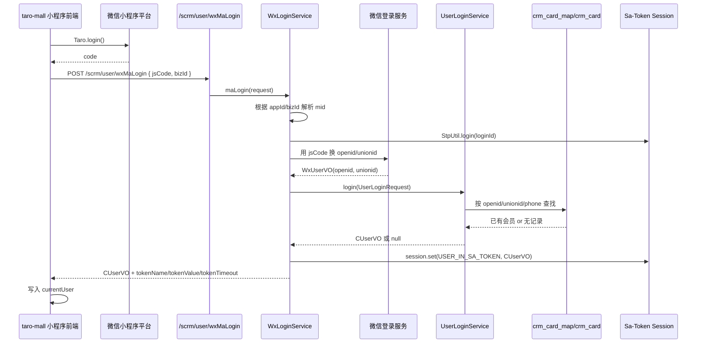
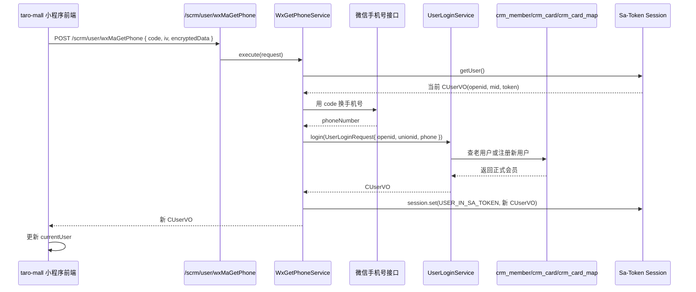
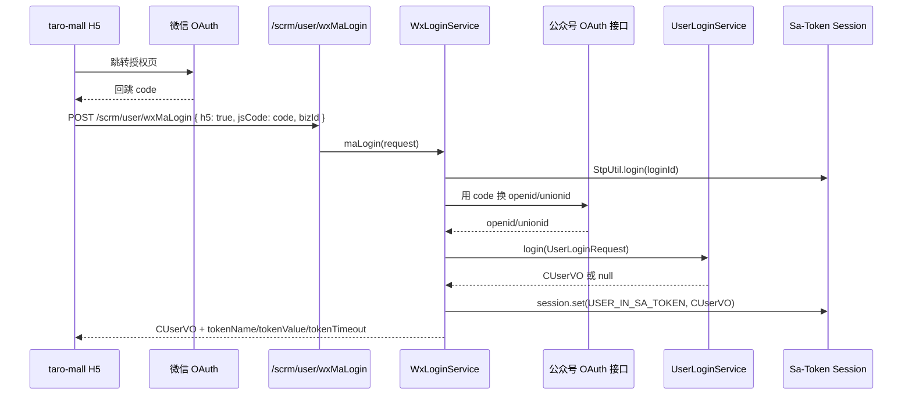

# 微信C端登录获取 token 链路分析

## 1. 分析范围

- 前端：`D:\mywork\taro-mall`
- 后端：`D:\mywork\nms4cloud`
- 目标：搞清楚微信 C 端是如何登录、如何拿到 `token`、`token` 存在哪里、后续请求如何带上这个 `token`

---

## 2. 结论先说

这套系统里，微信 C 端拿 `token` 的统一入口是：

- `POST /scrm/user/wxMaLogin`

无论是：

- 小程序 `wx.login()` 登录
- H5 微信浏览器 OAuth 回跳登录

最终都会走到这个接口。

后端在这个接口里做了两件事：

1. 先通过微信 `code` 或回跳参数换出微信身份，核心是 `openid/unionid`
2. 再通过 `Sa-Token` 创建登录态，把
   - `tokenName`
   - `tokenValue`
   - `tokenTimeout`

写入 `CUserVO` 返回给前端。

前端拿到后会：

1. 存入 `userStore.currentUser`
2. 持久化到本地缓存
3. 后续所有请求通过统一 `request()` 自动把 `token` 挂到请求头

一个重要特征是：

- `token` 的发放和“是否已经注册成正式会员”不是强绑定的
- 用户第一次进来即使还没有 `cardLid`，后端也可能先发 `token`
- 后面再通过 `wxMaGetPhone` 补手机号，完成会员注册或绑定

---

## 3. 核心文件定位

### 3.1 前端

- 登录接口封装：`D:\mywork\taro-mall\src\common\service\api\auth.ts`
- 请求统一封装：`D:\mywork\taro-mall\src\common\utils\request.ts`
- 登录态检查：`D:\mywork\taro-mall\src\common\func\useCheckLogin.ts`
- H5 微信授权回跳入口：`D:\mywork\taro-mall\src\pagesIndex\pageIndex\h5.tsx`
- 小程序手机号补全入口：`D:\mywork\taro-mall\src\components\LoginBtn\index.tsx`
- 用户缓存：`D:\mywork\taro-mall\src\common\store\user.ts`

### 3.2 后端

- 登录控制器：`D:\mywork\nms4cloud\nms4cloud-app\2_business\nms4cloud-crm\nms4cloud-crm-app\src\main\java\com\nms4cloud\crm\app\controller\biz\CrmAuthController.java`
- 微信登录服务：`D:\mywork\nms4cloud\nms4cloud-app\2_business\nms4cloud-crm\nms4cloud-crm-service\src\main\java\com\nms4cloud\crm\service\user\WxLoginService.java`
- 用户查找/注册服务：`D:\mywork\nms4cloud\nms4cloud-app\2_business\nms4cloud-crm\nms4cloud-crm-service\src\main\java\com\nms4cloud\crm\service\user\UserLoginService.java`
- 补手机号服务：`D:\mywork\nms4cloud\nms4cloud-app\2_business\nms4cloud-crm\nms4cloud-crm-service\src\main\java\com\nms4cloud\crm\service\user\WxGetPhoneService.java`
- C 端登录态对象：`D:\mywork\nms4cloud\nms4cloud-starter\nms4cloud-starter-parent\src\main\java\com\nms4cloud\common\satoken\vo\CUserVO.java`
- 获取当前 C 端用户：`D:\mywork\nms4cloud\nms4cloud-starter\nms4cloud-starter-parent\src\main\java\com\nms4cloud\common\service\BaseService.java`

---

## 4. 前端怎么发起登录

## 4.1 小程序登录

前端入口在 `auth.ts`：

```ts
export const wxLogin = (data) => {
  return Taro.login().then(({ code }) => {
    return request({
      url: `/scrm/user/wxMaLogin`,
      data: { ...data, jsCode: code },
    }, true)
  })
}
```

含义：

1. 调微信小程序原生登录接口 `Taro.login()`
2. 拿到微信临时登录凭证 `code`
3. 把 `code` 作为 `jsCode` 发给后端 `/scrm/user/wxMaLogin`

这里的 `true` 表示这次请求本身是“登录请求”，不要在请求层再做一次 token 过期检查。

---

## 4.2 H5 微信浏览器登录

H5 入口在 `pagesIndex/pageIndex/h5.tsx`。

整体流程：

1. 用户首次进入 H5 页面
2. 如果是微信浏览器且 URL 中还没有 `state`
3. 前端先调用 `buildAuthorizationUrl()` 构造微信 OAuth 地址
4. 跳转到微信授权页
5. 微信回跳后 URL 带回 `code`
6. 前端调用 `h5WxLogin()`
7. `h5WxLogin()` 仍然请求 `/scrm/user/wxMaLogin`

关键代码逻辑：

```ts
const res = await h5WxLogin({
  bizId,
  jsCode: activateUrl ? '' : urlSearchParams.get('code'),
  activateUrl,
  h5: true,
})
```

所以 H5 和小程序虽然入口不同，但后端统一处理。

---

## 5. 后端登录入口是什么

控制器 `CrmAuthController` 非常直接：

```java
@PostMapping(value = "/wxMaLogin")
public Mono<NmsResult<CUserVO>> wxMaLogin(@Valid @RequestBody CrmWxMaLoginRequest request)
    throws Exception {
  return wxLoginService.maLogin(request);
}
```

也就是说：

- 前端的 `/scrm/user/wxMaLogin`
- 最终进入 `WxLoginService.maLogin()`

`CrmWxMaLoginRequest` 的关键字段：

- `jsCode`
- `activateUrl`
- `h5`
- `notWxBrowser`
- `appId`
- `bizId`

---

## 6. token 是在哪一层生成的

token 不是微信给的，也不是前端自己算的，而是后端在 `WxLoginService.maLogin()` 里用 `Sa-Token` 创建的。

关键代码：

```java
String loginId = IdWorkerPlus.getIdStr();
StpUtil.login(loginId, false);
final SaTokenInfo tokenInfo = StpUtil.getTokenInfo();
final SaSession session = StpUtil.getSession();
```

然后把 token 信息回填到 `CUserVO`：

```java
session.set(CommonConstants.USER_IN_SA_TOKEN, userVO);
userVO.setTokenName(tokenInfo.getTokenName());
userVO.setTokenValue(tokenInfo.getTokenValue());
userVO.setTokenTimeout(
    SystemClock.now() + (tokenInfo.getTokenTimeout() - 20L) * 1000);
```

### 6.1 这里要注意的点

这套实现里：

- `loginId` 不是 `openid`
- `loginId` 也不是 `cardLid`
- `loginId` 是随机生成的 `IdWorkerPlus.getIdStr()`

真正的业务用户信息是：

- 放在 `SaSession`
- key 是 `CommonConstants.USER_IN_SA_TOKEN`
- value 是 `CUserVO`

所以这套系统鉴权的本质是：

- `tokenValue` -> 定位到 Sa-Token session
- session 里再取出 `CUserVO`

而不是直接用 token 解出 `openid`

---

## 7. 微信身份是怎么换出来的

## 7.1 小程序

小程序分支在 `WxLoginService.getUser()`：

```java
WxMa4LoginRequest wxMa4LoginRequest = BeanUtilsPlus.mapBean(request, WxMa4LoginRequest.class);
wxMa4LoginRequest.setMid(mid);
wxMa4LoginRequest.setAppId(request.getAppId());
return wxMaAuthReactiveFeign
    .login(wxMa4LoginRequest)
    .doOnNext(BaseService::assertIsSuccess)
    .map(NmsResult::getData);
```

含义：

- 把前端 `wx.login()` 拿到的 `jsCode`
- 发到微信相关服务
- 换出 `WxUserVO`
- 里面核心是 `openid` 和 `unionid`

---

## 7.2 H5 OAuth

H5 走 `getWxUserVO()`，普通 OAuth 分支：

```java
WxMpOath2AccessTokenDTO wxMpOath2AccessTokenDTO = new WxMpOath2AccessTokenDTO();
wxMpOath2AccessTokenDTO.setCode(request.getJsCode()).setAppId(request.getAppId());
return wxMpOAuth2FeignPlus
    .getAccessToken(wxMpOath2AccessTokenDTO)
    .map(NmsResult::getData)
    .map(i -> {
      WxUserVO wxUser = new WxUserVO();
      wxUser.setOpenid(i.getOpenId());
      wxUser.setUnionid(i.getUnionId());
      return wxUser;
    });
```

也就是：

- H5 微信 OAuth 回跳 `code`
- 后端调用公众号 OAuth 接口
- 换出 `openid/unionid`

---

## 7.3 会员卡激活回跳

如果请求里有 `activateUrl`，后端不是走普通 OAuth，而是解析回跳参数：

- `openid`
- `activate_ticket`
- `encrypt_code`

再去微信侧补拿开卡填写信息。

这条链路主要是会员卡激活，不是普通扫码首登的主链路，但它最终仍然会落到统一登录和发 token。

---

## 8. 用户信息怎么映射到业务会员

微信身份拿到之后，`WxLoginService.maLogin()` 会组装一个 `UserLoginRequest`：

```java
UserLoginRequest.builder()
    .cardType(request.isH5() ? CardTypeEnum.WECHAT_MP : CardTypeEnum.WECHAT_MINI)
    .appId(appId)
    .openId(wxUser.getOpenid())
    .unionId(wxUser.getUnionid())
    .birthday(wxUser.getBirthday())
    .name(Optional.ofNullable(wxUser.getNickName()).orElse("微信用户"))
    .sex(wxUser.getGender())
    .phone(wxUser.getPhoneNumber())
    .build();
```

之后交给：

- `UserLoginService.login(userLoginRequest)`

这个服务负责决定：

- 是老用户直接登录
- 还是新用户注册
- 还是暂时只保留微信身份，等后续补手机号

---

## 9. UserLoginService 做了什么

`UserLoginService.login()` 的核心逻辑是：

1. 先查 `crm_card_map`
2. 再兜底查 `crm_card`
3. 找到则返回已有会员
4. 找不到时，如果缺手机号且当前又要求手机号，则返回 `null`
5. 否则进入注册逻辑，创建 `crm_member`、`crm_card`、`crm_card_map`

## 9.1 查老用户

核心是 `queryUserInfoFromDb()` / `queryUserInfoFromDbALL()`。

查找维度包括：

- `openid`
- `unionid`
- `phone`

优先使用 `crm_card_map`，兜底用 `crm_card` 里的 `openid/unionid/phone` 找。

## 9.2 注册新用户

注册时会创建：

- `CrmMember`
- `CrmCard`
- `CrmCardMap`

其中：

- `CrmCard.openid = request.getOpenId()`
- `CrmCard.unionid = request.getUnionId()`

并且会把这些映射写入 `CrmCardMap`。

## 9.3 为什么有时候登录成功但没有会员卡

因为这里存在一个分支：

```java
if (StringUtils.isBlank(request.getPhone())
    && !Boolean.TRUE.equals(request.getNotNeedPhone())) {
  return null;
}
```

这意味着：

- 微信身份已经拿到了
- token 也已经发了
- 但业务会员还没法注册，因为没有手机号

这就是为什么前端可能拿到：

- `openid`
- `tokenName`
- `tokenValue`
- `tokenTimeout`

但 `cardLid` 还是空的。

---

## 10. 首登未注册用户如何补全成正式会员

这个动作走：

- `POST /scrm/user/wxMaGetPhone`

前端入口在 `LoginBtn`：

1. 小程序按钮用 `openType='getPhoneNumber'`
2. 用户授权手机号
3. 前端拿到 `detail.code`
4. 调用 `getPhoneNoInfo()`

后端 `WxGetPhoneService.execute()` 做的事：

1. 先用当前 token 从 session 里拿 `CUserVO`
2. 把 `openid/mid` 补到请求里
3. 调微信接口换手机号
4. 再组装新的 `UserLoginRequest`
5. 再次调用 `UserLoginService.login()`
6. 成功后把新的 `CUserVO` 回写到 session

关键代码：

```java
final CUserVO user = getUser();
request.setOpenid(user.getOpenid());
request.setMid(user.getMid());
final SaSession session = StpUtil.getSession();
```

以及：

```java
CUserVO cUserVO =
    Optional.ofNullable(userLoginService.login(userLoginRequest)).orElse(user);
session.set(CommonConstants.USER_IN_SA_TOKEN, cUserVO);
```

这说明：

- `wxMaGetPhone` 是建立在“已经拿到 token”基础上的二次补全
- 不是重新发一套完全独立的登录逻辑

---

## 11. 前端 token 存在哪里

前端登录成功后会执行：

```ts
replaceState(res.data || {})
```

`userStore` 定义里：

```ts
@observable currentUser = isH5
  ? Tips.getSessionStorage(KEY_IN_STORAGE)
  : Taro.getStorageSync(KEY_IN_STORAGE)
```

并且：

- H5 存到 `sessionStorage`
- 小程序存到 `Taro.setStorageSync`

缓存 key 是：

- `currentUser`

所以前端本地拿到的登录态核心就在：

- `currentUser.tokenName`
- `currentUser.tokenValue`
- `currentUser.tokenTimeout`
- `currentUser.openid`

---

## 12. 前端后续请求如何带 token

统一请求入口在 `src/common/utils/request.ts`。

关键逻辑：

```ts
if (!_.isEmpty(currentUser.tokenName)) {
  header[currentUser.tokenName || ''] = currentUser.tokenValue
}
```

这说明：

- 请求头名称不是前端写死的
- 用的是后端返回的 `tokenName`
- 请求头值是后端返回的 `tokenValue`

所以如果后端返回的是：

- `tokenName = satoken`
- `tokenValue = xxx`

那实际请求头就是：

```http
satoken: xxx
```

如果后端返回的是别的名字，前端也会照样带。

---

## 13. 前端如何自动续登

前端有两层自动续登。

## 13.1 页面级检查

`useCheckLogin.ts` 中：

- 如果 `tokenTimeout` 过期
- 或没有 `cardId`
- 或 `forceRefresh`

就执行 `doLogin()`。

## 13.2 请求级检查

`request.ts` 中：

- 每次请求前默认都会检查 `tokenTimeout`
- 过期就自动重新调用
  - H5：`h5WxLogin()`
  - 小程序：`wxLogin()`

然后用新的 token 再发业务请求。

所以这套前端并不是“登录一次就永远用缓存”，而是会在请求层自动续登。

---

## 14. 当前 C 端用户在后端怎么取

业务代码里取当前 C 端用户统一走：

```java
public static CUserVO getUser() {
  if (!StpUtil.isLogin()) {
    throw new BizException(BizCodeEnum.OPS_NEED_LOGIN);
  }
  return (CUserVO) StpUtil.getSession().get(CommonConstants.USER_IN_SA_TOKEN);
}
```

所以后端鉴权后的实际用户来源不是数据库即时查询，而是：

- `tokenValue`
- 定位到 `SaSession`
- 从 `SaSession` 取出 `CUserVO`

---

## 15. CUserVO 里有哪些关键字段

`CUserVO` 至少包含这些和登录强相关的字段：

- `mid`
- `sid`
- `openid`
- `unionid`
- `memberLid`
- `cardLid`
- `cardId`
- `phone`
- `tokenName`
- `tokenValue`
- `tokenTimeout`
- `appId`

也就是说，后端返回给前端的并不是只有 token，而是“用户业务信息 + 鉴权信息”的组合。

---

## 16. 完整时序图

## 16.1 小程序登录拿 token



## 16.2 小程序首登后补手机号



## 16.3 H5 微信浏览器登录



---

## 17. 你本地验证这条链路时该看什么

## 17.1 前端抓包看这几个请求

- `/scrm/user/wxMaLogin`
- `/scrm/user/wxMaGetPhone`
- 任意后续业务接口，比如 `/scrm/crm_card_op/customer/get_member_info`

重点看：

- 登录响应里是否返回 `tokenName/tokenValue/tokenTimeout/openid`
- 后续业务请求头里是否真的带了 `tokenName: tokenValue`

## 17.2 前端本地缓存看什么

小程序：

- `currentUser`

H5：

- `sessionStorage` 中按 `bizId_currentUser` 存的对象

重点字段：

- `openid`
- `tokenName`
- `tokenValue`
- `tokenTimeout`
- `cardLid`

## 17.3 后端日志建议打点

最值得打日志的地方：

- `WxLoginService.maLogin()`
  - 入参 `bizId/appId/jsCode/h5`
  - `mid`
  - 微信返回的 `openid/unionid`
  - 最终返回的 `tokenName/tokenValue/tokenTimeout/cardLid`

- `UserLoginService.login()`
  - 是否命中已有 `crm_card_map`
  - 是否返回 `null`
  - 是否进入注册分支

- `WxGetPhoneService.execute()`
  - 当前 session 中的 `openid`
  - 微信手机号解密结果
  - 是否补全成正式 `cardLid`

## 17.4 数据库重点看哪几张表

- `crm_card_map`
- `crm_card`
- `crm_member`

重点确认：

- `openid` 是否已映射到 `cardLid`
- `unionid` 是否已落库
- 补手机号后 `cardLid` 是否从无到有

---

## 18. 一句话总结

这套系统的微信 C 端登录本质是：

- 前端先用微信拿 `code`
- 后端统一走 `/scrm/user/wxMaLogin`
- 后端用微信 `code` 换 `openid/unionid`
- 同时用 `Sa-Token` 发 token
- 把 `tokenName/tokenValue/tokenTimeout` 放进 `CUserVO` 返回前端
- 前端把 token 存本地，并在统一请求层自动挂到请求头
- 如果用户还没正式注册会员，则后续再通过 `wxMaGetPhone` 基于当前 token 补齐手机号和会员信息

也就是说：

- `token` 来源于后端 `Sa-Token`
- `openid` 来源于微信
- 两者在登录接口里被拼成同一个 `CUserVO` 返回给前端

